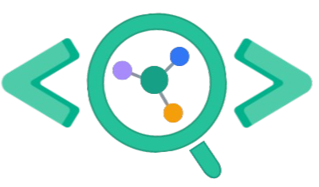
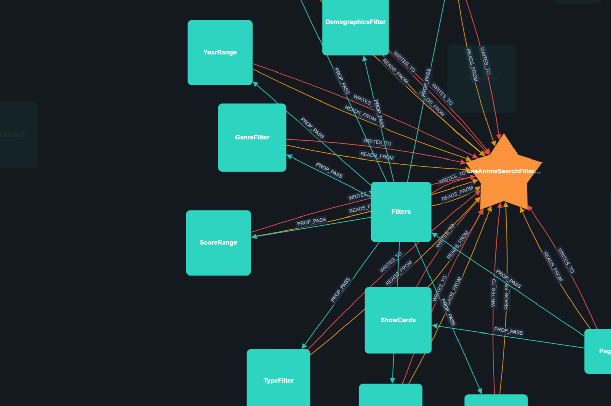

<div align="center">



<h1>DevLens</h1>

<p><strong>Codebase intelligence for TypeScript / JavaScript / React / Next.js / Node.js.</strong><br/>
Turn any repo into a queryable graph of nodes and typed edges — each with AI technical, business, and security summaries — and use it from your <strong>CLI</strong>, your <strong>AI agent (MCP + Skill)</strong>, or an <strong>interactive web UI</strong>. Runs entirely on your machine.</p>

[](https://www.gnu.org/licenses/agpl-3.0)
[](https://www.npmjs.com/package/@devlensio/cli)
[](https://bun.sh)

**[Join the Cloud Waitlist →](https://devlens.io)**

---

[](https://youtu.be/6OMsk8lNv4c?si=wpYF80IcfuJpN_Gf)
*Click to watch the demo*

</div>

---

## Table of Contents

- [What is DevLens?](#what-is-devlens)
- [Why it helps](#why-it-helps)
- [The four surfaces](#the-four-surfaces)
- [Quick start](#quick-start)
- [1 · CLI (`@devlensio/cli`)](#1--cli-devlensiocli)
  - [CLI command reference](#cli-command-reference)
- [2 · MCP server](#2--mcp-server)
- [3 · Agent Skill (`/devlens`)](#3--agent-skill-devlens)
- [4 · Web UI](#4--web-ui)
- [Configuration](#configuration)
- [What DevLens understands](#what-devlens-understands)
- [Architecture & repo layout](#architecture--repo-layout)
- [DevLens Cloud](#devlens-cloud)
- [Releasing](#releasing)
- [Contributing](#contributing)
- [License](#license)

---

## What is DevLens?

AI coding tools let you ship faster than ever — but that speed creates a new problem: **codebases grow faster than anyone (human or AI) can understand them.** Developers merge code they didn't fully read; new hires drown in unfamiliar structure; agents burn tokens re-reading files they've seen before.

DevLens turns any React / Next.js / Node.js / TypeScript repo into a **living, queryable map**:

1. **Walks the AST** — extracts every component (with prop types), hook, function (typed params + return), store, utility, route, and file.
2. **Builds a typed dependency graph** — `CALLS`, `IMPORTS`, `READS_FROM`, `WRITES_TO`, `PROP_PASS`, `EMITS`, `LISTENS`, `WRAPPED_BY`, `GUARDS`, `HANDLES`, `TESTS`, `USES`, `NEXTJS_API_CALL`, `NAVIGATES_TO`.
3. **Scores every node** by architectural importance (multi-pass, no AI).
4. **Summarizes each node** with an LLM — a **technical** summary (what it does), a **business** summary (what it means for the product), and a **security** assessment (severity + notes).
5. **Serves that graph** to you through a CLI, an MCP server, an agent skill, and an interactive web UI.

The analysis engine is the separate [`devlensio`](https://www.npmjs.com/package/devlensio) package; **DevLens OSS** is everything you interact with on top of it. Everything runs locally — your code never leaves your machine.

---

## Why it helps

- **Understand AI-generated code** — a visual + queryable map of what was built and how it connects, in plain English.
- **Onboard in hours, not weeks** — explore the graph and read per-node summaries instead of spelunking files.
- **Blast-radius & impact analysis** — before you change something, see exactly what depends on it.
- **Architecture audits** — surface central nodes, circular dependencies, and bottlenecks.
- **Security review** — every node carries a severity + explanation; list and prioritize them.
- **Living documentation** — summaries regenerate as code changes; unchanged nodes are reused (90%+ free on re-runs).
- **Token-efficient agents** — a node summary is ~50 tokens vs ~2000 for the file. Agents query the graph instead of reading files, and target work with blast-radius/k-hop instead of scanning directories.

---

## The four surfaces

| Surface | What it is | Install | Best for |
| :-- | :-- | :-- | :-- |
| **CLI** | `devlens` command — analyze + query from the terminal, JSON-friendly | `npm i -g @devlensio/cli` | scripts, terminals, CI |
| **MCP server** | `devlens mcp` — 14 tools over the Model Context Protocol | bundled in the CLI | Claude, Cursor, any MCP client |
| **Agent Skill** | `/devlens` — teaches an agent how to drive the CLI | `npx @devlensio/skill install` | Claude Code, Cursor, Kilo, opencode, pi |
| **Web UI** | interactive graph visualizer (Next.js) | `bun run dev` (from source) | visual exploration |

All four read the same graph stored in `~/.devlens`.

---

## Quick start

### Install

**Standalone binary — one command, no Node or Bun required** (downloads a prebuilt native binary from GitHub Releases into `~/.devlens/bin`):

macOS / Linux:
```sh
curl -fsSL https://raw.githubusercontent.com/devlensio/devlensOSS/main/scripts/install.sh | sh
```

Windows (PowerShell):
```powershell
irm https://raw.githubusercontent.com/devlensio/devlensOSS/main/scripts/install.ps1 | iex
```

Override the location with `DEVLENS_INSTALL_DIR`, or pin a version with `DEVLENS_VERSION=v0.2.6` (`$env:DEVLENS_VERSION` on Windows). The Windows script also adds the install dir to your `PATH`.

**Or via npm** (cross-platform, requires Node) — also bundles the MCP server:
```bash
npm install -g @devlensio/cli
```

### Use

```bash
# One-time: pick an LLM provider for summaries (or skip for structure-only)
devlens init

# Analyze a repo (run inside it) — add --summarize for AI summaries
devlens analyze . --summarize

# Explore
devlens overview
devlens find-nodes Button
devlens blast-radius "src/auth/login.ts::login"
```

> **Behind a corporate proxy?** If `npm install` fails with `UNABLE_TO_VERIFY_LEAF_SIGNATURE`, point Node at your org's root CA: `export NODE_EXTRA_CA_CERTS=/path/to/corp-ca.pem`.

---

## 1 · CLI (`@devlensio/cli`)

The `devlens` command analyzes a repo and lets you query the resulting graph. Every query command supports `--json` (machine-readable) and `-g <graphId>` / `-c <commit>` to target a specific graph/commit (default: the graph for the current directory).

**Typical flow:** `devlens init` → `devlens analyze . --summarize` → query commands (`overview`, `find-nodes`, `get-node`, `blast-radius`, …).

### CLI command reference

Global options available on every command: `--json` (machine-readable output), `-v, --verbose` (diagnostics), `-h, --help`.

#### Setup & environment

| Command | Description |
| :-- | :-- |
| `devlens init` | First-time setup — interactively configure your LLM provider for summarization. |
| `devlens doctor` | Check environment health (git, storage, LLM provider). Run this when something fails. |
| `devlens config [options]` | Show or update config in `~/.devlens/config.json`. |
| `devlens status` | Show analyzed + summarized graphs (per graph: commits, `latestCommit`, `summarizedCommits`). |
| `devlens repos` | List repositories DevLens has already analyzed. |
| `devlens graphs list` / `devlens graphs delete <graphId>` | List or delete stored graphs. |

`devlens config` options: `--set` (interactive), `--provider <anthropic\|openai\|openrouter\|gemini\|ollama>`, `--model <m>`, `--api-key <k>`, `--base-url <u>` (e.g. `http://localhost:11434` for Ollama), `--batch-size <n>`.

#### Analyze & summarize

**`devlens analyze [path] [commitHash]`** — analyze a repo into a graph.
- `path` (default `.`) — repository path.
- `commitHash` — informational; the engine analyzes the working tree.
- `--summarize` — also generate technical/business/security summaries (costs LLM calls).
- `--force-summarize` — re-summarize every node from scratch.
- `--latest` — analyze the working tree including uncommitted changes (current default).
- _Example:_ `devlens analyze . --summarize`

**`devlens summarize [target] [commit]`** — run analysis then summarization.
- `target` (default `.`) — repo path or an existing `graphId`.
- `--force-summarize` — ignore prior summaries.
- `--model <model>` / `--provider <anthropic|openai|openrouter|gemini|ollama>` — override for this run.

#### Orient & find

**`devlens overview`** — repo fingerprint (framework, router, state, data, db), stats (`totalNodes`/`totalEdges`), `routeCount`, and the most-central nodes/files. Start here. _(opts: `-g`, `-c`)_

**`devlens top-nodes`** — highest-scoring (most central) nodes. `-l, --limit <n>` (default 25). _(opts: `-g`, `-c`)_

**`devlens find-nodes [name]`** — search/filter nodes (compact refs, not source).
- `name` — substring match on node name.
- `-t, --type <types...>` — COMPONENT, HOOK, FUNCTION, STATE_STORE, UTILITY, ROUTE, FILE, TEST, STORY, THIRD_PARTY.
- `-f, --file <path>` — nodes in exactly this file. `-d, --dir <path>` — nodes under this folder.
- `--node-ids <ids...>` — fetch exact ids. `--min-score <n>`. `--severity <low|medium|high>` — min security severity.
- `-l, --limit <n>` (default 25). _(opts: `-g`, `-c`)_
- _Example:_ `devlens find-nodes -t ROUTE -l 500 --json`

**`devlens nodes-in-path <path>`** — every node in a file or folder. `-t, --type <types...>` to filter. _(opts: `-g`, `-c`)_

#### Understand (summaries & detail)

**`devlens get-node <nodeId>`** — full detail for one node: summaries + callers + callees (each connection carries `viaEdge`). Your main inspection tool.
- `-i, --include <sections...>` — `metadata|callers|callees|technical|business|security` (narrow the payload).
- `-e, --edge-types <types...>` — filter caller/callee edges. _(opts: `-g`, `-c`)_

**`devlens get-summaries <nodeIds...>`** — batch summaries for many ids. `-i, --include <kinds...>` — `technical|business|security` (business = functional). _(opts: `-g`, `-c`)_

**`devlens node-code <nodeId>`** — raw source for a node. **Expensive — prefer `get-node`.** _(opts: `-g`, `-c`)_

#### Structure & impact

**`devlens blast-radius <nodeId>`** — **upstream** dependents ("what breaks if I change this"). `-r, --radius <n>` (default 2, capped on huge fan-out; an explicit value is uncapped). `-e, --edge-types <types...>`. _(opts: `-g`, `-c`)_

**`devlens khop <nodeId>`** — **downstream** dependencies ("what this needs"). Same `-r` / `-e`. _(opts: `-g`, `-c`)_

**`devlens subgraph <seedNodeId>`** — the cohesive cluster around a node (returns `clusterId`, nodes, edges). _(opts: `-g`, `-c`)_

**`devlens cycles`** — circular-dependency groups. _(opts: `-g`, `-c`)_

**`devlens diff <from> <to>`** — changed nodes between two commits + blast radius of the changes. `-r, --radius <n>` (default 1). _Both commits must already be analyzed into the graph._ _(opts: `-g`)_

#### Security

**`devlens security`** — nodes flagged with security concerns (severity + per-node explanation). `--min-severity <low|medium|high>` (default low). `-l, --limit <n>` (default 50). _(opts: `-g`, `-c`)_

#### Serve & integrate

**`devlens serve [path]`** — start the backend API server (used by the web UI). `-p, --port <port>` (default 3000).

**`devlens mcp`** — run the MCP server. Subcommands: `stdio` (default — for editors/agents) and `http [-p, --port <port>]` (Streamable HTTP, default port 7000). See [§2](#2--mcp-server).

---

## 2 · MCP server

The CLI binary embeds a Model Context Protocol server exposing **14 tools** over the same graph (`list_analyzed_repos`, `get_repo_overview`, `find_nodes`, `get_node`, `get_blast_radius`, `get_khop`, `get_subgraph`, `list_cycles`, `get_security_issues`, `analyze_changes`, `get_summaries`, `get_nodes_in_path`, `get_node_code`, and more).

```bash
devlens mcp            # stdio (what an editor/agent spawns)
devlens mcp http -p 7000   # Streamable HTTP at http://localhost:7000/mcp
```

Register it in a client (Claude Code shown):

```bash
claude mcp add devlens -- devlens mcp
```

Or add to any MCP client config:

```json
{ "mcpServers": { "devlens": { "command": "devlens", "args": ["mcp"] } } }
```

> **Windows + Claude Desktop:** if the server won't start, wrap it: `{ "command": "cmd", "args": ["/c", "devlens", "mcp"] }`.

Registered in the official MCP registry as **`io.github.devlensio/devlens`**.

---

## 3 · Agent Skill (`/devlens`)

The DevLens **Agent Skill** teaches your AI coding agent *how* to drive the CLI — when to query the graph, how to keep output token-cheap, and how to produce thorough architecture/security/impact reports. It's one `/devlens` command with subcommands.

```bash
# Install into whatever AI tools it detects (Claude Code, Cursor, Kilo, opencode, pi)
npx @devlensio/skill install
```

Or, for Claude Code, install the plugin:

```text
/plugin marketplace add devlensio/devlensOSS
/plugin install devlens@devlensio
```

Subcommands: `/devlens init`, `architecture`, `diagram`, `summary`, `security-analysis`, `explain`, `tech-debt`, `impact`, `find`, `changes`, `guard`. See [plugins/devlens/README.md](plugins/devlens/README.md) and [packages/skill-installer/README.md](packages/skill-installer/README.md).

---

## 4 · Web UI

An interactive graph visualizer (Next.js + Cytoscape) — force-directed canvas, node detail panels, search/filter, commit-diff overlay, and a security panel. Runs from source against the local backend:

```bash
git clone https://github.com/devlensio/devlensOSS.git
cd devlensOSS
bun install
bun run dev          # starts the backend (src/server) + the frontend
```

Open the printed URL, paste the absolute path to a repo (must have a root `package.json`), and click **Analyze**.

---

## Configuration

Config lives in `~/.devlens/config.json` and is set via `devlens init` / `devlens config` (or the Web UI's Config panel). Summaries need an LLM provider; structural analysis does not.

### Supported providers

| Provider | Recommended model | Notes |
| :-- | :-- | :-- |
| Ollama (local) | `qwen2.5-coder:7b` | Free, local, 8GB+ RAM. Slow on large repos. |
| OpenAI | `gpt-4o-mini` | Fast, cost-effective |
| Anthropic | `claude-haiku-4-5` | Excellent code understanding |
| OpenRouter | `grok-4.1-fast` | 100+ models; best cost/quality balance |
| Gemini | `gemini-2.0-flash` | Fast, large context |

```bash
devlens config --provider openrouter --model grok-4.1-fast --api-key <key>
# Ollama (local, no key): devlens config --provider ollama --model qwen2.5-coder:7b --base-url http://localhost:11434
```

> Avoid free-tier OpenRouter models — their rate limits are too low for a full summarization run.

---

## What DevLens understands

**Node types:** `COMPONENT`, `HOOK`, `FUNCTION`, `STATE_STORE`, `UTILITY`, `FILE`, `ROUTE`, `TEST`, `STORY`, `THIRD_PARTY` (plus an internal `GHOST` placeholder).

**Routes:** Next.js (app & pages), Express / Fastify / Koa, and **React Router / TanStack Router / wouter** (routes defined in code via `<Route>`, `createBrowserRouter`, `useRoutes`, etc.). `ROUTE` nodes carry a `routeNodeType` — `PAGE`, `LAYOUT`, `API_ROUTE`, `LOADING`, `ERROR`, `MIDDLEWARE`, `NOT_FOUND`, or `REACT_ROUTER_ROUTE` — and React Router routes link to the component they render via a `HANDLES` edge.

**Edge types:** `CALLS`, `IMPORTS`, `READS_FROM`, `WRITES_TO`, `PROP_PASS`, `EMITS`, `LISTENS`, `WRAPPED_BY`, `GUARDS`, `HANDLES`, `TESTS`, `USES`, `NEXTJS_API_CALL` (frontend data-fetch call site → Next.js API route), `NAVIGATES_TO` (client-side navigation → the ROUTE it targets).

**Per node:** an importance score, a technical summary, a business/functional summary, and a security assessment (`none|low|medium|high` + notes). Connection results carry the edge type via a `viaEdge` field.

---

## Architecture & repo layout

DevLens OSS is the set of interfaces built on top of the [`devlensio`](https://www.npmjs.com/package/devlensio) analysis engine (a separate package).

```
devlensOSS/
├── src/
│   ├── cli/                 # the `devlens` CLI (commander program + commands)
│   ├── core/                # shared query core (used by CLI + MCP — never drift)
│   ├── mcp/                 # MCP server (stdio + Streamable HTTP), 14 tools
│   └── server/              # backend API for the Web UI (SSE job streaming)
├── frontend/                # Next.js 15 graph visualizer (Cytoscape)
├── bin/devlens.cjs          # npm launcher → execs the per-platform native binary
├── npm/<platform>/          # 5 prebuilt-binary packages (@devlensio/cli-<os>-<arch>)
├── plugins/devlens/         # the /devlens Agent Skill (Claude plugin)
├── packages/skill-installer/# @devlensio/skill — the npx skill installer
├── scripts/                 # set-version.mjs, set-skill-version.mjs, stage-binaries.mjs
├── .claude-plugin/          # marketplace.json (Claude plugin catalog)
└── server.json              # MCP registry manifest
```

The analysis pipeline (AST parsing, edge detection, scoring, summarization) lives in `devlensio`, not here.

---

## DevLens Cloud

A hosted version is in development: GitHub integration (no local clone), shareable graphs, team annotations, a natural-language interface over your graph, semantic search across summaries, automatic PR review summaries, and persistent cloud storage.

**[Join the waitlist →](https://devlens.io)**

---

## Releasing

The repo ships independently-versioned artifacts:

| Artifact | Package | Version source | Channel |
| :-- | :-- | :-- | :-- |
| CLI + MCP | `@devlensio/cli` (+ 5 platform pkgs) | `scripts/set-version.mjs` | npm (Trusted Publishing / OIDC) on `v*` tag |
| Agent skill | `@devlensio/skill` + Claude plugin | `scripts/set-skill-version.mjs` | npm + git (see [packages/skill-installer/README.md](packages/skill-installer/README.md)) |
| Engine | `devlensio` | the separate `devlens-engine` repo | npm |

### Release the CLI

`scripts/set-version.mjs <ver>` stamps every manifest in lockstep — the main package, all 5 `npm/<platform>/package.json`, the pinned `optionalDependencies`, `server.json` (MCP registry), and the CLI's hardcoded `--version`. Pushing a `v*` tag triggers `.github/workflows/release.yml`, which builds the binaries and publishes to npm (via OIDC), the MCP registry, and the GitHub release.

```bash
# 0. (if the engine changed) publish devlensio first, then bump the "devlensio" pin here + `bun install`
node scripts/set-version.mjs 0.2.6        # 1. bump all manifests
git add -A && git commit -m "release: @devlensio/cli 0.2.6"   # 2. commit (include bun.lock)
git push && git tag v0.2.6 && git push origin v0.2.6          # 3. tag → triggers CI
```

> The binaries bundle whatever `devlensio` resolves to **at build time**; CI installs the published version from the pin, so an engine fix reaches users only after `devlensio` is republished **and** the pin is bumped. After bumping deps, run `bun install` so `bun.lock` matches (CI uses `--frozen-lockfile`).

### Release the Agent skill

Versioned separately from the CLI. `node scripts/set-skill-version.mjs <ver>` stamps the installer + plugin together; then `npm publish` the installer and push the plugin. See [packages/skill-installer/README.md](packages/skill-installer/README.md).

---

## Contributing

DevLens is actively under development. Bugs, ideas, and PRs welcome — open an issue or PR. All contributions remain open source under AGPL v3. A detailed `CONTRIBUTING.md` will follow as the project matures.

---

## License

DevLens is licensed under the [GNU Affero General Public License v3.0](LICENSE).

You are free to use, modify, and distribute DevLens. If you run a modified version as a hosted service, you must release your modifications under the same license.
