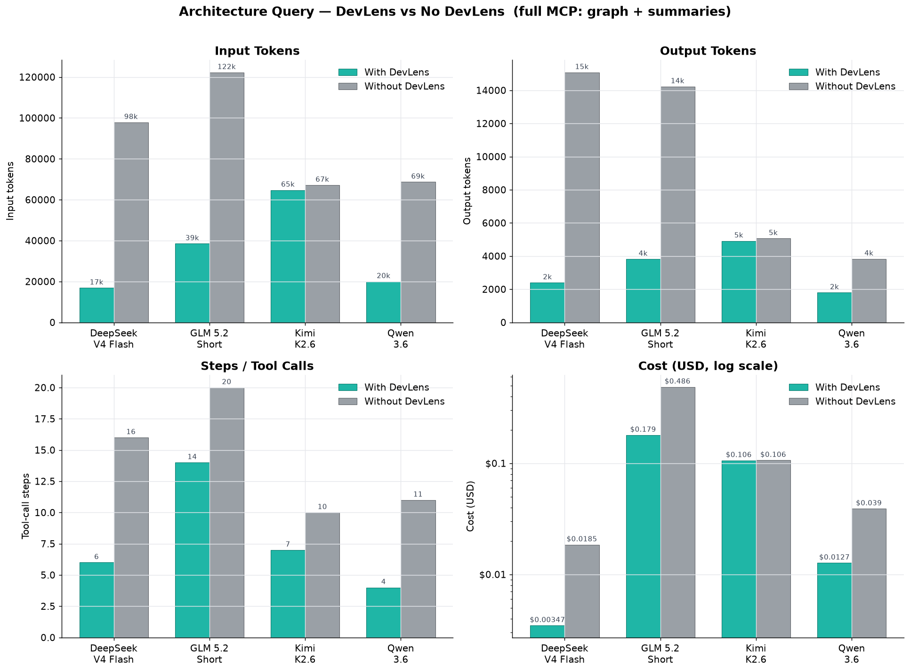
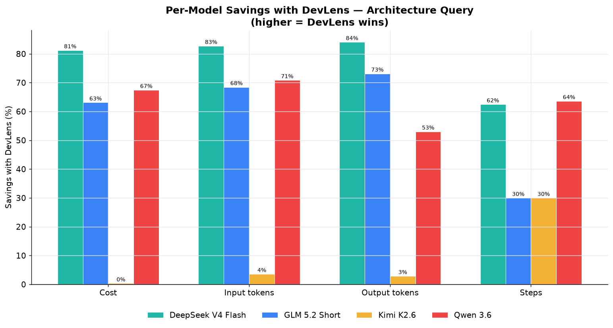
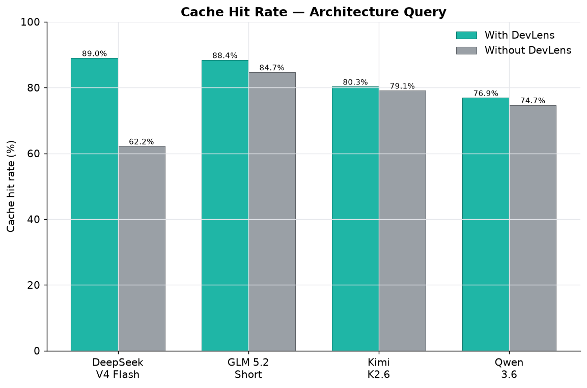
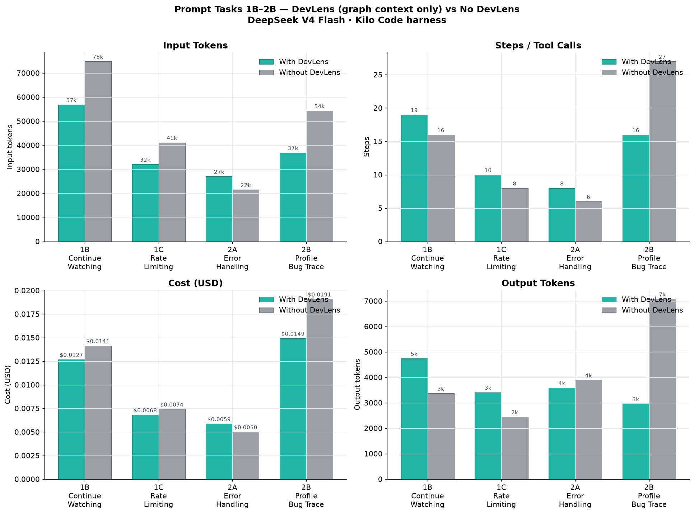
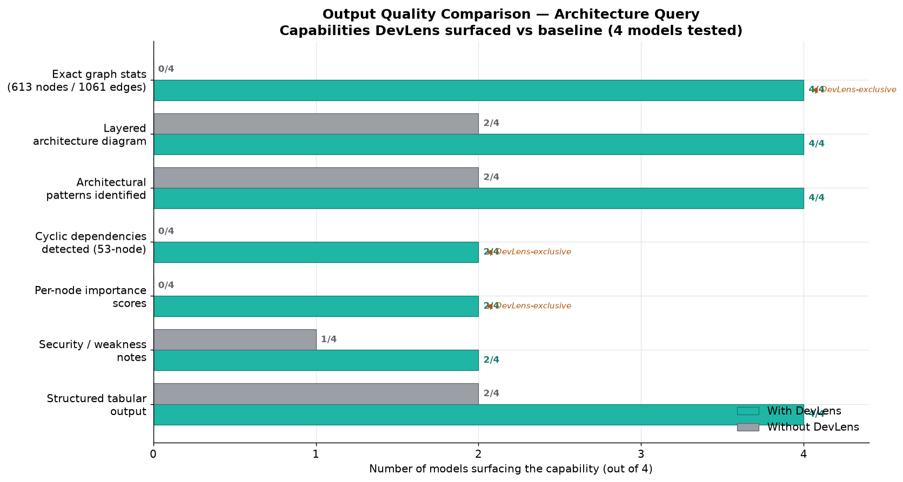
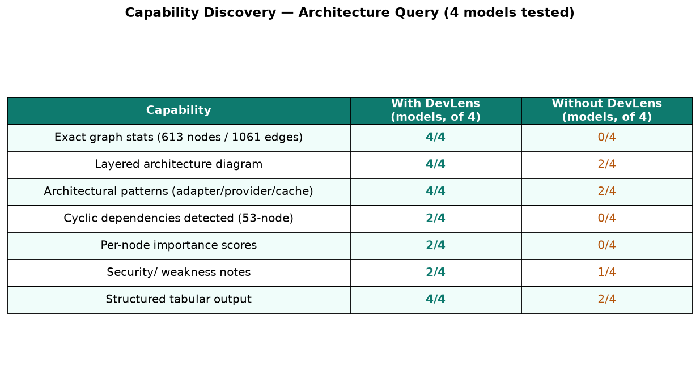

<div align="center">


# DevLens

**Intelligent codebase visualizer.**

Turn any JavaScript, TypeScript, React, Next.js, or Node.js repo into a living, queryable map — with functional summaries, technical summaries, and security analysis on every node.

[](https://www.gnu.org/licenses/agpl-3.0)
[](https://www.npmjs.com/package/@devlensio/cli)
[](https://bun.sh)

**[Join the DevLens Cloud Waitlist →](https://devlens.io)**

</div>

---

[](https://youtu.be/6OMsk8lNv4c?si=wpYF80IcfuJpN_Gf)

<p align="center"><em>Click the image to watch the demo</em></p>

---

## Is this for you?

DevLens is a **codebase visualizer** for JavaScript, TypeScript, React, Next.js, and Node.js codebases. It turns your repo into a living, queryable map with functional summaries, technical summaries, and security analysis on every component, hook, function, and route.

### For developers & teams

- **Onboard new devs in hours, not weeks** — explore the graph instead of spelunking files
- **Review PRs with full context** — see exactly what depends on each change
- **Run impact analysis before refactoring** — "what breaks if I change this?"
- **Catch circular deps, god-files, and coupling hotspots** automatically
- **Keep living documentation** — summaries stay fresh as code changes

### For engineering leaders

- **Get a bird's-eye view** of your entire codebase in seconds
- **Spot architectural debt** before it becomes a crisis
- **Understand what your team has been building** — even across repos

### For students & learners

- **See how real codebases are designed** — layers, patterns, data flow
- **Understand why things are connected**, not just what each file does
- **Learn architecture patterns** from production-grade projects

### For AI-augmented developers

Your agent burns tokens re-reading files it's seen before. DevLens gives it a graph to query instead: **~50 tokens per node vs ~2,000 per file**.

> **Coming soon — DevLens Cloud:** Shareable graphs your whole team can access, cross-repo navigation, and giving graphical context to your AI agents for smarter code review and analysis — all without running anything locally.

---

## Quick Start

**1. Install**

```bash
npm install -g @devlensio/cli
```

No Node.js? One-command standalone binary installer:

```bash
curl -fsSL https://raw.githubusercontent.com/devlensio/devlensOSS/main/scripts/install.sh | sh
```

**2. Init**

```bash
cd your-project
devlens init
```

This sets up your LLM provider for AI summaries. Don't need AI? Skip this — structural analysis works offline.

**3. Analyze**

```bash
devlens analyze . --summarize
```

This builds a typed dependency graph of every component, hook, function, route, and store — with AI-powered summaries on each node.

**4. Explore**

```bash
devlens overview                  # big picture: framework, stats, central nodes
devlens find-nodes -t ROUTE       # find every route in the app
devlens security                  # see security flags across the codebase
```

---

## The problem DevLens solves

AI coding tools let you ship faster than ever — but that speed creates **AI debt**: code merged without understanding, agents re-discovering connections every session, new hires drowning in unfamiliar structure.

DevLens fixes this by pre-building a **typed dependency graph** of your entire codebase. Every node gets:

- **Functional summary** — what business purpose does this serve?
- **Technical summary** — how does it work?
- **Security assessment** — severity + explanation

Armed with this graph, you (or your AI agent) can understand the full architecture in **~50 tokens per node** instead of ~2,000 per file.

---

## Real benchmarks: with DevLens vs without

*Tested across real-world tasks — architecture understanding, feature implementation, and bug finding — comparing the same model (DeepSeek V4 Flash, GLM 5.2, Kimi K2.6, Qwen 3.6) with and without DevLens.*

### Architecture understanding (4 models, full DevLens MCP)

<div align="center">

</div>

| Metric | Without DevLens | With DevLens | Improvement |
|--------|:--------------:|:------------:|:-----------:|
| Avg cost per query | $0.163 | **$0.075** | **54% cheaper** |
| Avg input tokens | 88,980 | **35,035** | **61% less** |
| Avg output tokens | 9,549 | **3,233** | **66% less** |
| Avg tool steps | 14.3 | **7.8** | **45% faster** |
| Structured architecture output | 50% | **100%** | **2× more reliable** |
| Architectural debt discovered | 0% | **50%** | **Now discoverable** |
| Avg cache hit rate | 75.2% | **83.7%** | **+8.5pp** |

<div align="center">


</div>

> Even the strongest model (DeepSeek V4 Flash) was **81% cheaper** ($0.0035 vs $0.0185) and used **83% fewer input tokens** with DevLens.

### Feature implementation & bug finding (DeepSeek V4 Flash)

*5 prompts across implementation and debugging tasks — DevLens graph context only (no per-node summaries).*

<div align="center">

</div>

| Task | Input tokens saved | Cache improvement |
|------|:-----------------:|:-----------------:|
| Continue Watching feature | **24%** less input (56.8k vs 74.9k) | +5.2pp cache |
| Rate Limiting feature | **22%** less input (32.1k vs 41.1k) | +8.3pp cache |
| Error Handling audit | *(comparable)* | Comparable |
| Profile Bug trace | **32%** less input (36.9k vs 54.3k) | Similar |

### Quality impact (architecture task)

<div align="center">


</div>

When asked to explain a codebase's architecture:

| Capability | Without DevLens | With DevLens |
|-----------|:--------------:|:------------:|
| Produced structured output | 50% | **100%** |
| Referenced specific graph metrics | 0% | **100%** |
| Identified architectural debt | 0% | **50%** |
| Named specific important files | 75% | **100%** |

---

## Ways to use DevLens

Pick the interface that fits your workflow:

---

###  Web UI — Visual exploration

*For when you want to see your codebase laid out as an interactive graph.*

Open the Web UI, paste your repo path, and explore a force-directed canvas — click any node to see its summaries, callers, callees, and security flags. Search, filter, diff commits across versions.

```bash
git clone https://github.com/devlensio/devlensOSS.git
cd devlensOSS && bun install && bun run dev
```

---

###  CLI (`@devlensio/cli`) — Terminal power

*For scripts, CI, and when you want answers fast without leaving the terminal.*

Query the graph directly: find nodes, trace blast radius before refactoring, spot circular dependencies, list security issues.

```bash
npm install -g @devlensio/cli
devlens overview                  # see the big picture
devlens blast-radius <nodeId>     # "what breaks if I change this?"
devlens cycles                    # find circular deps
devlens security                  # list every security issue
```

Each command works with `--json` for piping into scripts and CI pipelines.

→ **[Full CLI reference](src/cli/README.md)** — every command with examples and options.

---

###  Agent Skill (`@devlensio/skill`) — AI-powered understanding

*The most powerful way to use DevLens. For when you want your AI coding agent to understand your full codebase in one command.*

Your AI agent normally reads files one at a time — it has no idea how your codebase fits together. The DevLens Skill teaches it to query the pre-built graph instead. Type `/devlens` in Claude Code, Cursor, or Kilo:

```bash
npx @devlensio/skill install
```

Then reload your tool and use:

| Command | What it does |
|---------|-------------|
| `/devlens architecture` | Full system overview — stack, modules, routes, patterns |
| `/devlens security-analysis` | Prioritized security findings with exploit notes |
| `/devlens impact <symbol>` | Blast radius — what breaks if you change this? |
| `/devlens tech-debt` | Circular deps, coupling hotspots, god-files |
| `/devlens onboard` | Generate ONBOARDING.md for new devs |
| `/devlens explain [path]` | Understand a module with callers/callees |
| `/devlens find <name>` | Locate any component, hook, or function |
| `/devlens changes [range]` | Explain what changed and its impact |
| `/devlens diagram` | Mermaid diagrams of architecture or flows |

→ **[Full Skill reference](packages/skill-installer/README.md)** — all subcommands with examples, install options, supported tools.

---

###  MCP Server — For any MCP-compatible AI agent

*For when you want to wire DevLens into any MCP client (Claude Desktop, IDE plugins, etc.).*

Bundled inside the CLI — exposes 14 tools over the Model Context Protocol.

```bash
devlens mcp                       # stdio mode
claude mcp add devlens -- devlens mcp   # register in Claude Code
```

→ **[MCP docs](src/mcp/README.md)** — tool reference, registration, config.

---

## Configuration

Config lives in `~/.devlens/config.json` — set via `devlens init` or `devlens config`.

| Provider | Recommended model | Notes |
| :-- | :-- | :-- |
| Ollama (local) | `qwen2.5-coder:7b` | Free, local, 8GB+ RAM |
| OpenAI | `gpt-4o-mini` | Fast, cost-effective |
| Anthropic | `claude-saunnet-family` | Excellent code understanding |
| OpenRouter | `deepseek-v4-flash` or `mimo-v2.5` | Best cost/quality balance |
| Gemini | `gemini-2.0-flash` | Fast, large context |

```bash
devlens config --provider openrouter --model deepseek-v4-flash --api-key <key>
```

---

## What DevLens understands

**Node types:** `COMPONENT`, `HOOK`, `FUNCTION`, `STATE_STORE`, `UTILITY`, `FILE`, `ROUTE`, `TEST`, `STORY`, `THIRD_PARTY`

**Route types:** Next.js (app & pages), Express / Fastify / Koa, React Router / TanStack Router / wouter

**Edge types:** `CALLS`, `IMPORTS`, `READS_FROM`, `WRITES_TO`, `PROP_PASS`, `EMITS`, `LISTENS`, `WRAPPED_BY`, `GUARDS`, `HANDLES`, `TESTS`, `USES`, `NEXTJS_API_CALL`, `NAVIGATES_TO`

**Per node:** Importance score + functional summary + technical summary + security assessment

---

## Repository layout

```
devlensOSS/
├── src/
│   ├── cli/                  # `devlens` CLI (commander program + commands)
│   ├── core/                 # Shared query core (CLI + MCP — never drift)
│   ├── mcp/                  # MCP server (stdio + HTTP), 14 tools
│   └── server/               # Backend API for the Web UI
├── frontend/                 # Next.js 15 graph visualizer (Cytoscape)
├── plugins/devlens/          # Agent Skill (Claude plugin source)
├── packages/skill-installer/ # @devlensio/skill — npx installer
├── bin/                      # npm launcher
├── npm/<platform>/           # 5 prebuilt binary packages
├── scripts/                  # Release tooling
└── server.json               # MCP registry manifest
```

The analysis engine lives in the separate [`devlensio`](https://www.npmjs.com/package/devlensio) package.

---

## DevLens Cloud

A hosted version is in development:

- **Shareable graphs** your whole team can access
- **Cross-repo navigation** — understand your entire org
- **Give graphical context to AI agents** for smarter code review and analysis
- No local setup required

**[Join the waitlist →](https://devlens.io)**

---

## License

DevLens is licensed under the [GNU Affero General Public License v3.0](LICENSE). You are free to use, modify, and distribute it. If you run a modified version as a hosted service, you must release your modifications under the same license.