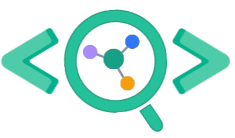
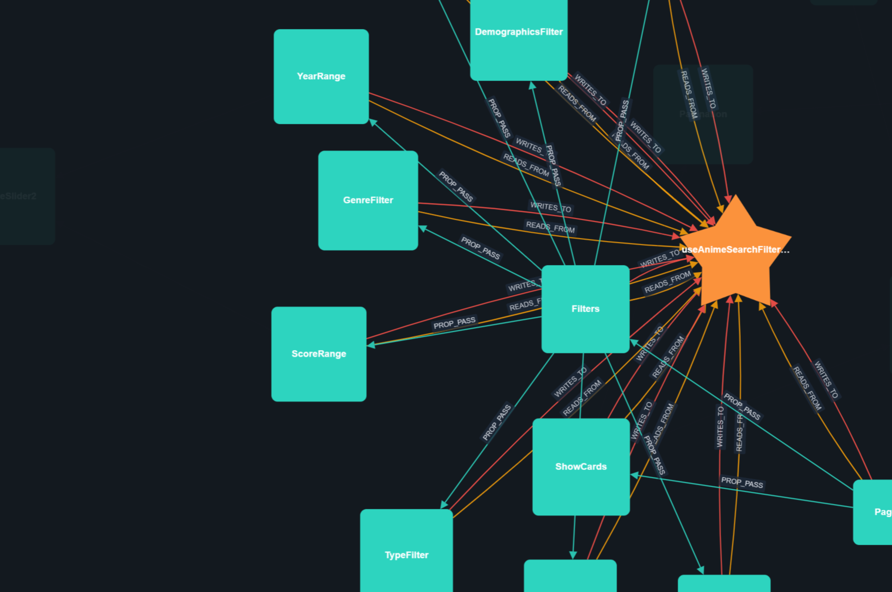
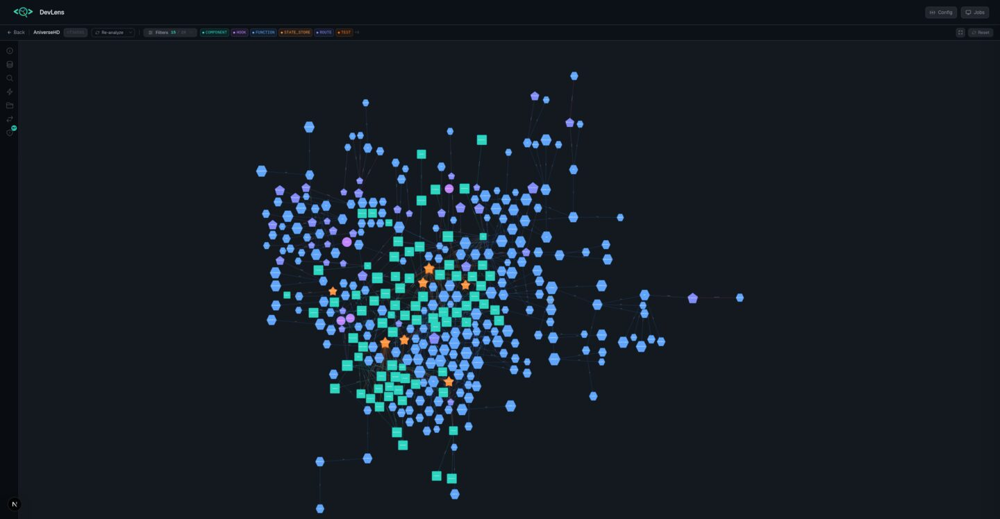
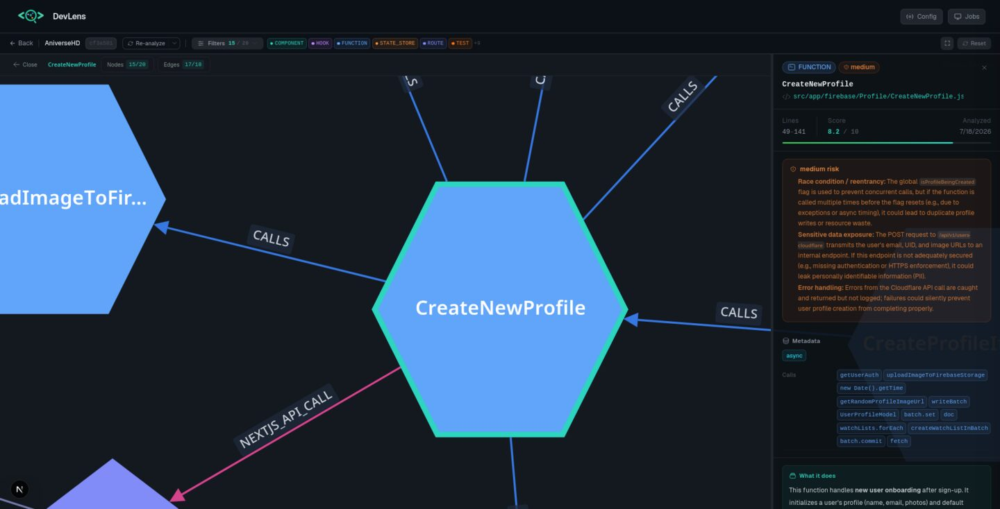
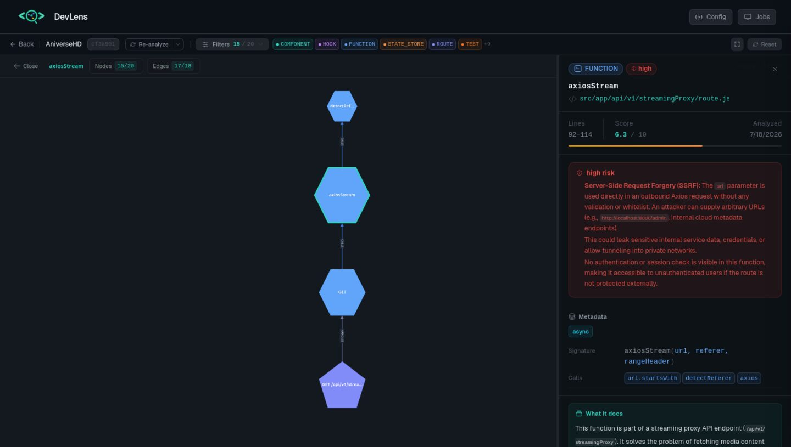
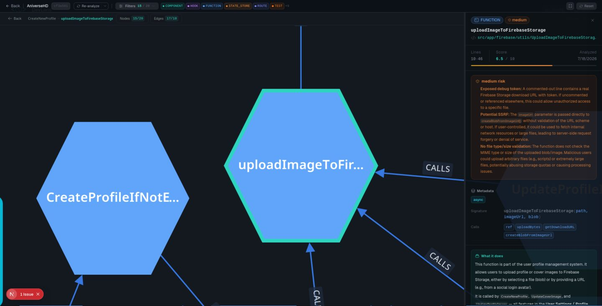
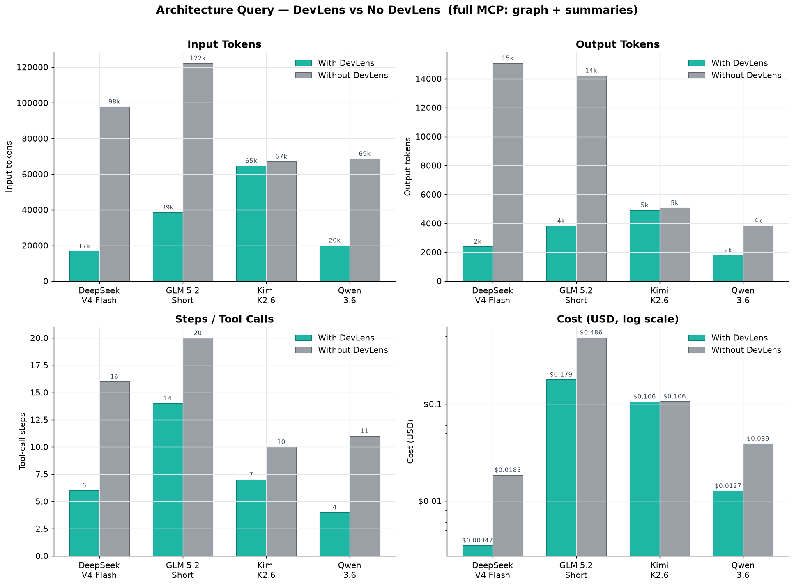

<div align="center">



# DevLens

**Intelligent codebase visualizer.**

Turn any TypeScript, JavaScript, Python, Go, Rust, or Java repository into a living, queryable graph — every node carries a functional summary, a technical summary, and a security assessment.

[](https://www.gnu.org/licenses/agpl-3.0)
[](https://www.npmjs.com/package/@devlensio/cli)
[](https://www.npmjs.com/package/@devlensio/skill)
[](https://bun.sh)

**[Join the DevLens Cloud Waitlist →](https://devlens.io)**

</div>

---

[](https://youtu.be/6OMsk8lNv4c?si=wpYF80IcfuJpN_Gf)

<p align="center"><em>Click the image to watch the demo</em></p>

---

## Table of Contents

- [What is DevLens?](#what-is-devlens)
- [Supported languages](#supported-languages)
- [Prerequisites](#prerequisites)
- [Quick Start](#quick-start)
- [Screenshots](#screenshots)
- [Why it's fast & cheaper](#why-its-fast--cheaper)
- [Ways to use DevLens](#ways-to-use-devlens)
  - [Web UI — visual exploration](#web-ui--visual-exploration)
  - [CLI — terminal power](#cli--terminal-power)
  - [Agent Skill — AI-powered understanding](#agent-skill--ai-powered-understanding)
  - [MCP Server — for any MCP-compatible AI agent](#mcp-server--for-any-mcp-compatible-ai-agent)
- [How to summarize](#how-to-summarize)
- [Configuration](#configuration)
- [What DevLens understands](#what-devlens-understands)
- [Benchmarks](#benchmarks)
- [Who is this for](#who-is-this-for)
- [How DevLens compares](#how-devlens-compares)
- [Repository layout](#repository-layout)
- [DevLens Cloud](#devlens-cloud)

---

## What is DevLens?

**DevLens turns a codebase into a pre-built dependency graph.** Instead of reading files one at a time, you (or your AI agent) query the graph: every component, class, function, route, struct, or trait is a **node**, and every connection is a **typed edge** (`CALLS`, `IMPORTS`, `HANDLES`, `IMPLEMENTS`, …). Each node carries:

- **Functional summary** — *what business purpose does this serve?*
- **Technical summary** — *how does it work?*
- **Security assessment** — *severity + explanation*

This is the difference between an AI that re-reads your whole repo every session and an AI that already knows the architecture — architecture reviews, impact analysis, security audits, and onboarding take **minutes, not hours**.

**Typical use cases:**

- **Onboarding** — a developer joining a new team sees the architecture, functional/ technical summaries, modules, and gotchas in minutes, not weeks.
- **Impact analysis** — *before* touching a symbol, see its blast radius: what breaks if you change it?
- **Security reviews** — every node carries a severity-ranked security assessment with real reach.
- **PR review** — a review packet that explains the diff's impact, tests, and security delta.
- **AI agents** — give Claude/Cursor/Kilo an MCP server + skill that queries the graph instead of re-reading files.

---

## Supported languages

DevLens parses **six languages with native parsers** (no AI, no regex, no tree-sitter) and understands their frameworks:

| Language | Frameworks / stacks the graph understands | What gets parsed |
| :-- | :-- | :-- |
| **TypeScript / JavaScript** | React, Next.js (app & pages router), Express/Hono/Fastify, React Router, TanStack Router, any Node | components, hooks, state stores, classes, methods, functions, routes |
| **Python** | FastAPI, Flask, Django (+DRF), SQLAlchemy / Django ORM, Celery, Pydantic | classes, methods, functions, routes, data models |
| **Java** | Spring Boot (controllers, JPA, Spring Data repositories) | classes, methods, interfaces, enums, routes |
| **Go** | net/http, Gin, Echo, chi, Fiber, GORM, database/sql | structs, interfaces, methods, functions, routes |
| **Rust** | axum, actix-web, rocket, utoipa, Diesel | structs, enums, traits, impl blocks, methods, functions, routes |

Each repo is analyzed with its language's own parser (Python `ast`, JavaParser, Go `go/ast` + `go/types`, Rust `syn`, TS compiler API), so edges are **real** — type-checked interfaces (`IMPLEMENTS`), framework routes (`HANDLES`), and ORM data layers (`READS_FROM`/`WRITES_TO`).

---

## Prerequisites

| Requirement | Needed for | Notes |
| :-- | :-- | :-- |
| [Bun](https://bun.sh) ≥ 1.x | Build & run from source (`bun install`, `bun run dev`, `bun start`) | macOS/Linux/Windows |
| [Node.js](https://nodejs.org) ≥ 18 | `npm install -g @devlensio/cli` (optional path) | not needed for the standalone binary |
| `git` | analyzing a repo (DevLens shells out to `git`) | required on all install paths |
| A JVM 17+ | Java analysis | only when analyzing Java repos |
| `python3` 3.11+ | Python analysis | only when analyzing Python repos |
| An LLM provider API key | AI summaries (optional) | needed only for `--summarize`; structure-only analysis works offline |

Summaries are **never generated silently** — the CLI and skill ask permission first, and structure-only analysis needs no provider at all.

---

## Quick Start

The fastest way to try the **full experience (Web UI + CLI + hot reload)** is to clone and run from source. The one-line installers give you the CLI with zero build time.

### Option A — Clone & develop (Web UI + CLI together, recommended)

```bash
git clone https://github.com/devlensio/devlensOSS.git
cd devlensOSS
bun install

# Development (backend on :3000, hot-reloaded frontend on :3001)
bun dev

# OR production — one command, API + Web UI on a single port (:3000)
bun start
```

Production `bun start` builds the frontend **only the first time** (later runs skip the rebuild unless you pass `--rebuild`) and serves the Web UI *and* the backend API on one port. Open the printed URL, paste an absolute repo path, and click **Analyze** (enable the skip summaries checkbox if you don't want summaries).

### Option B — Install the CLI from npm

```bash
npm install -g @devlensio/cli
```

### Option C — Install the standalone binary (no Node.js required)

The installers are verbose — they print progress, warnings, errors, and next steps, and **automatically add `devlens` to your `PATH`** (your shell's rc file on macOS/Linux, your user `PATH` on Windows).

```bash
# Linux / macOS
curl -fsSL https://raw.githubusercontent.com/devlensio/devlensOSS/main/scripts/install.sh | sh

# Windows (PowerShell)
irm https://raw.githubusercontent.com/devlensio/devlensOSS/main/scripts/install.ps1 | iex
```

Customize with environment variables: `DEVLENS_VERSION` (e.g. `v0.5.1`), `DEVLENS_INSTALL_DIR` (install folder), or `DEVLENS_NO_PATH=1` to skip the automatic PATH setup.

### Using any install — summarize, then explore

```bash
cd your-project
devlens init                       # optional — configure your AI provider for summaries
devlens analyze . --summarize      # build the graph + generate AI summaries
devlens overview                   # language, framework, stats, central nodes
devlens find-nodes -t ROUTE        # every route in the app
devlens architecture               # one-command architecture brief
devlens security                   # security flags across the codebase
```

Want it in your AI agent instead? Jump to [Agent Skill](#agent-skill--ai-powered-understanding).

---

## Screenshots

<div align="center">


<br/><br/>


<br/>
<em>Interactive graph explorer · node inspector with AI summaries & security risk · focused node subgraph · security findings</em>
</div>

---

## Why it's fast & cheaper

A node summary is **~50 tokens**. The file it describes is **~2,000**. Querying summaries and graph slices (`get_blast_radius`, `get_subgraph`) costs a fraction of reading files — humans get answers faster, and AI agents spend dramatically fewer tokens on the same task.

---

## Ways to use DevLens

Pick the interface that fits your workflow:

###  Web UI — visual exploration

*For when you want to see your codebase laid out as an interactive graph.*

Open the Web UI, paste your repo path, and explore a force-directed canvas — click any node to see its summaries, callers, callees, and security flags. Search, filter, diff commits across versions. The UI runs on a **live server**, so opening `/graph/<any-new-id>` (e.g. clicking a repository card) always renders the graph — even for repos analyzed after the server started.

```bash
# Production — one command, UI + API on one port (from the source repo)
bun run start
# → Web UI:  http://localhost:3000
```

Or from source (see [Quick Start](#quick-start)): `bun run dev` (hot reload) or `bun run start` (production). The Web UI runs from the source tree — it is **not** bundled into the installed CLI binary.

###  CLI (`@devlensio/cli`) — terminal power

*For scripts, CI, and answers fast without leaving the terminal. Every command supports `--json` for piping into scripts, `-v/--verbose` for diagnostics, and `--quiet` for minimal output.*

```bash
npm install -g @devlensio/cli
```

**Analyze & summarize**

| Command | What it does |
|---------|--------------|
| `devlens detect [path] [--deps]` | Inspect a repo **before** analyzing: language, manifest, dependency count, source files |
| `devlens analyze [path] [--summarize] [--force-summarize]` | Build the graph (optionally add AI summaries) |
| `devlens summarize [target]` | (Re)generate technical/business/security summaries (`target` = repo path or graph id) |
| `devlens status` | Which repos are analyzed, their language + summary coverage |
| `devlens doctor` | Environment health check — git, storage, LLM provider, and **all 4 extractor runtimes** (go/rust/java/python) |
| `devlens init` | First-time setup — configure the LLM provider interactively |

**Explore & understand**

| Command | What it does |
|---------|--------------|
| `devlens overview` | Big picture — language, framework, stats, central nodes |
| `devlens top-nodes [-l <n>]` | Highest-scoring (most central) nodes |
| `devlens find-nodes <name> [-t <type>]` | Search by name / type / file / severity (e.g. `-t ROUTE`, `-t CLASS`, `-t STRUCT`) |
| `devlens nodes-in-path <path>` | All nodes in a file or folder |
| `devlens get-node <id>` | Full detail for one node — summaries, callers, callees |
| `devlens get-summaries <ids…>` | Batch-read summaries for multiple nodes |
| `devlens node-code <id>` | Raw source for a node (expensive — prefer `get-node`) |
| `devlens architecture` | One-call architecture brief — modules, routes, flows, health |
| `devlens onboard-tour` | One-call onboarding skeleton — modules, routes, flows, glossary, gotchas |
| `devlens get-context <query>` | Token-budgeted context packet for an agent |

**Impact & quality**

| Command | What it does |
|---------|--------------|
| `devlens blast-radius <id>` | What breaks if I change this? (upstream dependents) |
| `devlens khop <id>` | What does it depend on? (downstream) |
| `devlens subgraph <seed>` | The cohesive cluster (module) a node belongs to |
| `devlens cycles` | Circular dependencies |
| `devlens security [--min-severity …]` | Security findings - severity + explanation |
| `devlens security-brief` | Ranked security report with blast-radius reach |
| `devlens diff <from> <to>` | Compare two analyzed commits |
| `devlens review-pr <from> <to>` | Full PR review packet — diff + impact + tests + security delta |
| `devlens check-freshness` / `coverage` | Is the graph stale vs HEAD? What's summarized? |

**Manage & integrate**

| Command | What it does |
|---------|--------------|
| `devlens config` | View / set LLM provider config (`~/.devlens/config.json`) |
| `devlens repos` | List analyzed repos |
| `devlens graphs list \| delete` | Manage stored graphs |
| `devlens serve` | Start the backend HTTP API only (used by MCP / skills / the Web UI) |
| `devlens mcp` | Run the MCP server (see below) |

**Hands-on examples**

```bash
devlens detect ./my-app                      # what is this repo? (cheap)
devlens analyze ./my-app --summarize         # build graph + AI summaries
devlens find-nodes -t ROUTE                  # every route in the app
devlens find-nodes Button                    # find a component by name
devlens blast-radius "src/auth/login.ts::login"   # what breaks if I change it?
devlens security --min-severity high         # critical security only
devlens graphs list                          # stored graphs
devlens graphs delete abc-123                # remove a graph
```

> **Full reference:** [`src/cli/README.md`](src/cli/README.md) — every command with options and examples.

###  Agent Skill — AI-powered understanding

*The most powerful way to use DevLens. Your AI agent normally reads files one at a time — the DevLens Skill teaches it to query the pre-built graph instead.*

```bash
npx @devlensio/skill install
```

Then reload your tool and use `/devlens` in Claude Code, Cursor, Kilo, opencode, pi, or any AI coding agent:

| Command | What it does |
|---------|--------------|
| `/devlens init` | Connect MCP, configure provider, analyze the repo |
| `/devlens architecture` | Full system brief — stack, modules, routes, patterns, security posture |
| `/devlens explain [path]` | Onboard to a module or the whole repo — callers, callees, reading path |
| `/devlens diagram [type]` | Mermaid diagrams (architecture, cluster, flow, deps) with typed edges |
| `/devlens security-analysis [level]` | Prioritized security report with reach + fix-order |
| `/devlens impact <symbol>` | Blast radius — what breaks if you change this? |
| `/devlens tech-debt` | Cycles, coupling hotspots, god-files |
| `/devlens guard [target]` | Warn before editing high-risk code |
| `/devlens onboard` | Write a saved `ONBOARDING.md` for new devs |
| `/devlens find <name>` | Locate any component, class, function, struct, or route |
| `/devlens summary <kind> <target>` | On-demand technical / functional / security summary |
| `/devlens changes [range]` | Explain recent work or a merge conflict, by functionality |

> **Full reference:** [`packages/skill-installer/README.md`](packages/skill-installer/README.md) — all subcommands, install options, and supported AI tools.

###  MCP Server — for any MCP-compatible AI agent

*Wire DevLens into any MCP client (Claude Code, Claude Desktop, IDE agents, …). The server is bundled inside the CLI and exposes **21 tools** covering discovery, search, traversal, security, and one-call workflow summaries.*

```bash
devlens mcp                       # stdio mode
claude mcp add devlens -- devlens mcp   # register in Claude Code
devlens mcp http -p 7000          # HTTP mode
```

Your agent can: list analyzed repos, get a repo overview, find nodes by name/type/severity, read summaries, trace blast radius / k-hop / subgraphs, find cycles, analyze a new repo, compare commits, and generate whole-packet **architecture/security/PR-review/onboarding/context** outputs from one call.

> **Full reference:** [`src/mcp/README.md`](src/mcp/README.md) — tool catalog, registration, configuration.

---

## How to summarize

Summaries are per-node AI descriptions that make querying much richer. To generate them:

```bash
# During analysis (recommended)
devlens analyze . --summarize

# Later, for a repo or a specific graph
devlens summarize .               # summarize the current directory's repo
devlens summarize <graphId>       # summarize a stored graph

# Re-generate even if already summarized (force)
devlens summarize . --force-summarize

# Choose a model / provider per-run (overrides saved config)
devlens summarize . --provider openai --provider-name deepseek --model deepseek-v4-flash
```

You'll be asked to confirm before tokens are spent — summaries are never generated silently. Configure your provider once with `devlens init` (or `devlens config`) and it's remembered for all future runs.

---

## Configuration

Config lives in `~/.devlens/config.json` and is set via `devlens init` or `devlens config`.

| Provider | Recommended model | Notes |
| :-- | :-- | :-- |
| Ollama (local) | `qwen2.5-coder:7b` | Free, local, 8 GB+ RAM |
| OpenAI | `gpt-4o-mini` | Fast, cost-effective |
| Anthropic | `claude-haiku-4-5` | Best cost/quality for summaries |
| DeepSeek | `deepseek-v4-flash` | Strong code model |
| OpenRouter | `deepseek-v4-flash` or `mimo-v2.5` | Best cost/quality balance |
| Gemini | `gemini-2.0-flash` | Fast, large context |

```bash
# Interactive setup — picks from a catalog and fetches live model lists
devlens config --set

# Non-interactive scripting
devlens config --provider openai --provider-name deepseek --model deepseek-v4-flash --api-key <key>

# Switch between saved providers without re-entering credentials
devlens config --active openai:deepseek

# Health check
devlens doctor
```

Models are discovered dynamically from each provider's `/models` endpoint — no hardcoded model lists. Custom OpenAI- or Anthropic-compatible endpoints can be added through the interactive flow.

---

## What DevLens understands

**Node types (per language — a graph is per-repo/per-language):**

| Language | Node types in the graph |
| :-- | :-- |
| TS / JS | `COMPONENT`, `HOOK`, `STATE_STORE`, `UTILITY`, `CLASS`, `METHOD`, `FUNCTION`, `ROUTE`, `FILE`, `TEST`, `STORY`, `THIRD_PARTY` |
| Python | `CLASS`, `METHOD`, `FUNCTION`, `ROUTE`, `FILE`, `TEST`, `THIRD_PARTY` |
| Java | `CLASS`, `METHOD`, `INTERFACE`, `ENUM`, `ROUTE`, `FILE`, `TEST`, `THIRD_PARTY` |
| Go | `STRUCT`, `INTERFACE`, `METHOD`, `FUNCTION`, `ROUTE`, `FILE`, `TEST`, `THIRD_PARTY` |
| Rust | `ENUM`, `STRUCT`, `TRAIT`, `IMPL_BLOCK`, `METHOD`, `FUNCTION`, `ROUTE`, `FILE`, `TEST`, `THIRD_PARTY` |

Every node carries: importance score + functional summary + technical summary + security assessment (when summarized).

NOTE: When a repo is re-summarized only the nodes without summaries are being summarized (incremental summarization) unless force-summarization is done. Thus saving unnecessary token consumption.

**Edge types (the connections the graph draws):**
`CALLS`, `IMPORTS`, `READS_FROM`, `WRITES_TO`, `PROP_PASS`, `EMITS`, `LISTENS`, `WRAPPED_BY`, `GUARDS`, `HANDLES`, `TESTS`, `USES`, `NEXTJS_API_CALL`, `NAVIGATES_TO`, `IMPLEMENTS` (class → interface / trait / ABC), `EXTENDS` (class → base class).

`EXPORTS` and `THROWS` + node types `MODULE`/`PACKAGE` are **reserved** for future languages.

**Router awareness — routes are real graph nodes:**
Next.js (app & pages), React Router / TanStack Router / wouter, Express / Fastify / Hono / Koa, Django URLconf / DRF, Flask blueprints, `@RestController` (Spring), Gin / Echo / chi / HTTP handlers, axum / actix / rocket.

---

## Benchmarks

*Tested across real-world tasks — architecture understanding, feature implementation, and bug finding — comparing the same model (DeepSeek V4 Flash, GLM 5.2, Kimi K2.6, Qwen 3.6) with and without DevLens.*

### Architecture understanding (full DevLens MCP)

<div align="center">

</div>

| Metric | Without DevLens | With DevLens | Improvement |
|--------|:--------------:|:------------:|:-----------:|
| Avg cost per query | $0.163 | **$0.075** | **54% cheaper** |
| Avg input tokens | 88,980 | **35,035** | **61% less** |
| Avg output tokens | 9,549 | **3,233** | **66% less** |
| Avg tool steps | 14.3 | **7.8** | **45% faster** |
| Structured output | 50% | **100%** | **2× more reliable** |
| Architectural debt found | 0% | **50%** | **Now discoverable** |

> Even the strongest tested model was **81% cheaper** ($0.0035 vs $0.0185) and used **83% fewer input tokens** with DevLens.

---

## Who is this for

- **Developers & teams** — onboard devs in hours not weeks, review PRs with impact context, catch circular deps and god-files, keep living documentation.
- **Engineering leaders** — bird's-eye architecture view, spot debt before it becomes a crisis, understand work across repos.
- **AI-augmented developers** — stop letting your agent burn tokens re-reading files; it queries the graph instead.

---

## How DevLens compares

DevLens is the **only tool in this space** that combines three things: native semantic parsing (not regex or tree-sitter), per-node AI summaries with per-node security analysis, and framework-aware data edges (routes, ORM reads/writes). That combination is what makes it uniquely suited for AI agents working inside a single codebase — and it's the only option you can use commercially under AGPL.

Every alternative trades away at least one of those capabilities:

| Dimension | **DevLens** | **Graphify** | **GitNexus** | **Sourcegraph** | **DeepWiki** |
| :-- | :-- | :-- | :-- | :-- | :-- |
| Core idea | Prebuilt semantic graph + per-node AI summaries + security | Syntactic knowledge graph + community detection | Agent-focused knowledge graph + taint analysis | Code search + AI assistant (Cody) | AI-generated docs per repo |
| Parsing depth | **✅ Native semantic parsers** (TS compiler, Python `ast`, `go/types`, JavaParser, `syn`) — type-resolved | tree-sitter (syntactic, no type info) | tree-sitter + native bindings (no type info) | SCIP/LSIF symbol index + language servers (no semantic parse) | LLM reads source directly (no structured parser) |
| Edge quality | **✅ Type-checked `IMPLEMENTS`/`EXTENDS`**, framework **routes** (Next.js/Django/Spring/Gin/axum), **ORM data edges** (`READS_FROM`/`WRITES_TO`) | `EXTRACTED`/`INFERRED`/`AMBIGUOUS` tags — no type or framework awareness | call chains, clusters, processes, `route_map` — no ORM/data edges | Precise symbol cross-references (SCIP) — no type-checked inheritance | Docs-level relationships (no structured graph) |
| Per-node AI summaries | **✅ Technical + business + security** with severity — every node carries all three | ❌ (LLM used for docs/concepts) | ❌ (embeddings for semantic query) | ✅ Via Cody (hover + inline docs — chat-level, not per-node graph summaries) | ✅ Auto-generated docs per symbol (no security, no technical/business split) |
| Security analysis | **✅ Per-node severity + blast-radius reach** — real exploit descriptions, not just flags | ❌ | Partial (opt-in PDG/taint — not built-in) | ❌ (SOC 2/ISO 27001 *compliance* only — no code-level findings) | ❌ |
| Agent / MCP integration | CLI + **21-tool MCP** + `/devlens` skill + Web UI | CLI + local skill (no MCP) | CLI + 17-tool MCP + skills + hooks (`AGENTS.md`) | MCP server (cross-repo search + Cody agent — not a per-repo graph query surface) | Unknown (no public MCP integration) |
| Language coverage | TS/JS, Python, Java, Go, Rust — **native parsers for each** | 12 code families + docs/images (shallow syntactic) | Many via tree-sitter (Dart/Kotlin/Swift…) — shallow syntactic | 30+ (via language servers — symbol-level, no semantic edges) | Any (LLM reads source — no structured extraction) |
| License / pricing | **✅ AGPL-3.0 — free, including commercial use** | Apache-2.0 | PolyForm Noncommercial (**cannot use commercially**) | Open-source core; **Enterprise paid** (cross-repo search) | Free for public repos; enterprise tiers unlisted |
| Multi-user cloud | In development (waitlist open) | No | Enterprise SaaS (paid) | Sourcegraph Enterprise (hosted, paid) | Web-hosted for public repos |

**Other notable alternatives:** CodeSee (service-level dependency mapping, enterprise-only), CodeQL (GitHub-native semantic security analysis — deep but no AI summaries or graph visualization), and ctags-based indexers (lightweight symbol indexes, no graph intelligence).

**Why teams choose DevLens over the others:**
- You get **semantic edges** (type-checked inheritance, ORM data flow, framework routes) that syntactic tools like Graphify and GitNexus simply can't produce — so your agent doesn't guess relationships, it knows them.
- You get **per-node security analysis** that no other open-source tool provides — not Sourcegraph (which only has compliance certifications), not GitNexus (which has optional PDG, not built-in), not DeepWiki (which ignores security entirely).
- You get **21 MCP tools + a universal `/devlens` skill** — a tighter, more purpose-built agent surface than Sourcegraph's general-purpose MCP or GitNexus's hooks.

(Feature comparison from public sources, Aug 2026.)

---

## Repository layout

```
devlensOSS/
├── src/
│   ├── cli/                  # `devlens` CLI (commander program + commands)
│   ├── core/                 # Shared query core (CLI + MCP — never drift)
│   ├── mcp/                  # MCP server (stdio + HTTP) — 21 tools
│   └── server/               # HTTP API for the Web UI + live Next.js web UI proxy
├── frontend/                 # Next.js graph visualizer (Cytoscape)
├── plugins/devlens/          # Agent Skill source (Claude plugin)
├── packages/skill-installer/ # @devlensio/skill — the npx installer
├── bin/                      # Platform launcher
├── npm/<platform>/           # 5 prebuilt binary packages (darwin/linux/windows × arm64)
├── scripts/                  # Release tooling + `start.mjs` (bun start build-or-skip)
└── server.json               # MCP registry manifest
```

The analysis engine (“native parsers + graph build”) ships as the separate [`devlensio`](https://www.npmjs.com/package/devlensio) package.

---

## DevLens Cloud

A hosted version is in development:

- **Shareable graphs** Share your graphs to the world.
- **Team Support** Create your team, and share same graph all across your team members.
- **Live Documentation** every commit holds summaries to each Node, thus maintaing live documentation of every commit / PR.
- **PR analysis** Detailed Analysis of the PRs raised as github comments including info like summary, impact analysis, security report etc
- **Graphical context for AI agents** — smarter code review and analysis with Devlens MCP to use with your agents
- **Commit Diff** - See the Commit diff, what nodes are modified/added/deleted with the diff and summary.
- **Interactive AI native chat interface** - Ask anything about your codebase to AI. Graphical context, and functional summaries provide accurate answers in seconds.
- **More interactive UI** The UI will be more human friendly and easy to Navigate. 
- **No local setup**

**[Join the waitlist →](https://devlens.io)**

---

## License

AGPL-3.0. Part of the [`devlensio`](https://github.com/devlensio) family of tools.
