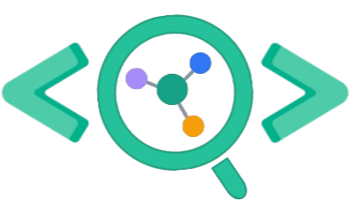
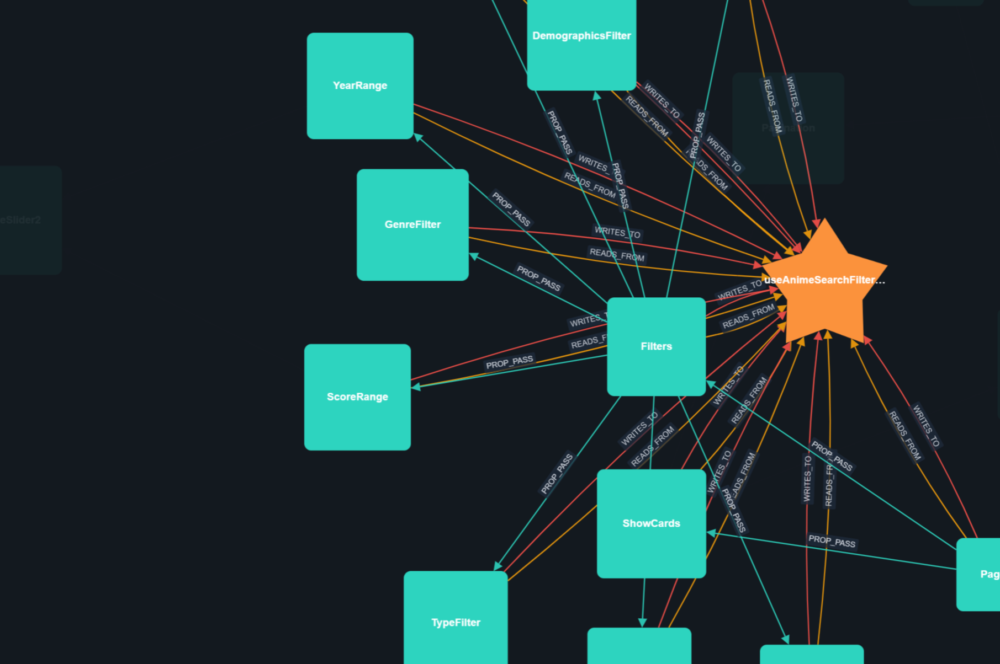
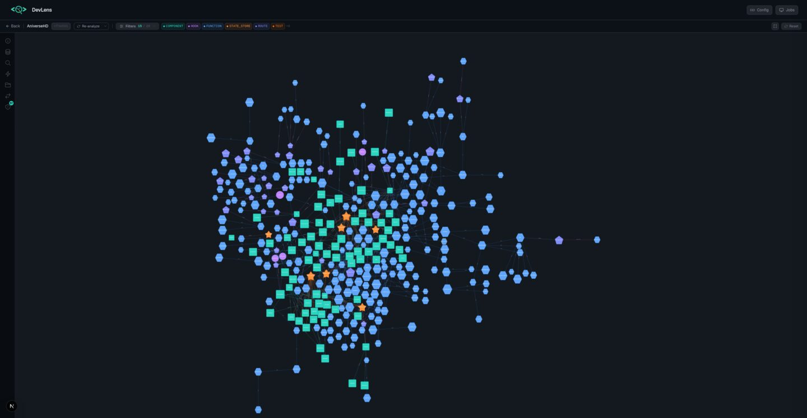
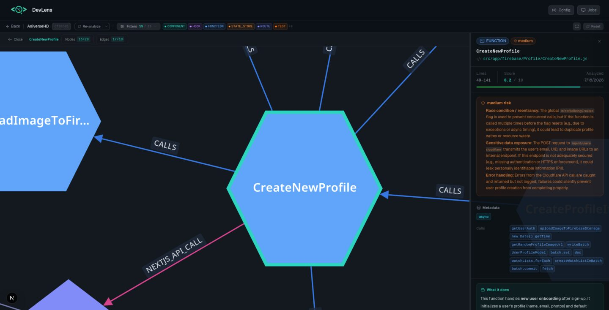
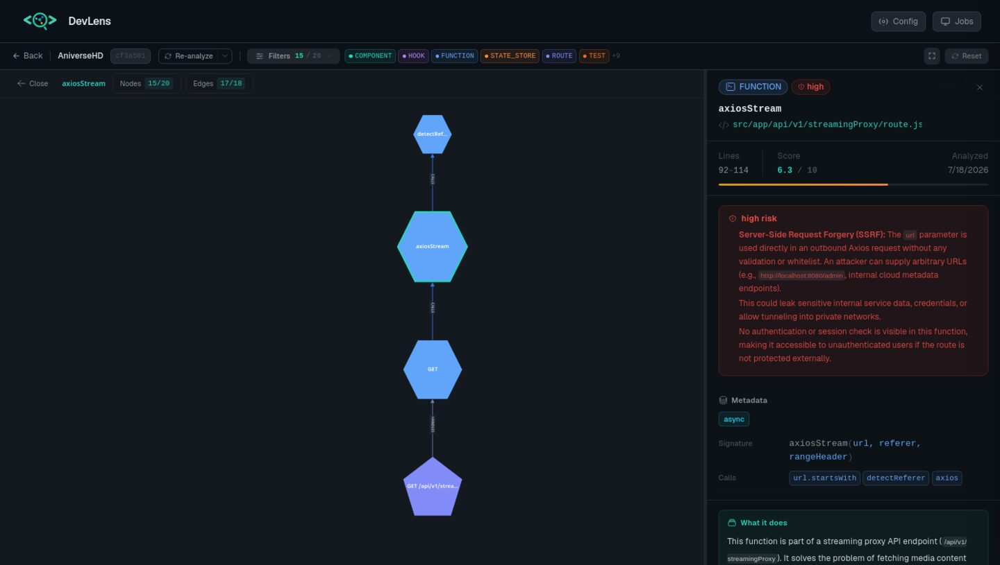
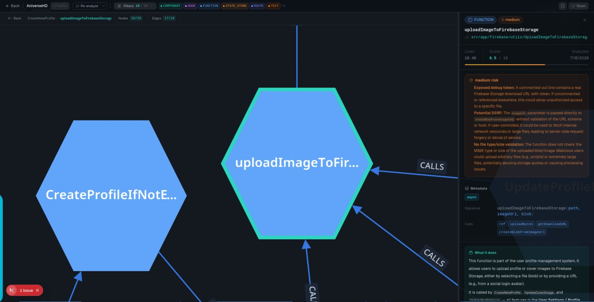

<div align="center">



# DevLens

**Codebase Intelligence for AI agents and Developers.**

Analyze your repo once. Your AI agent then queries a precomputed code graph through MCP — ranked files, call flow, impact, and security — instead of re-reading your codebase file by file. Ranked **first of nine tools** on every quality measure in our public benchmark.

[](https://www.gnu.org/licenses/agpl-3.0)
[](https://www.npmjs.com/package/@devlensio/cli)
[](https://bun.sh)

**[Join the DevLens Cloud Waitlist →](https://devlens.io)**

</div>

---

[](https://youtu.be/6OMsk8lNv4c?si=wpYF80IcfuJpN_Gf)

<p align="center"><em>Click the image to watch the demo</em></p>

---

## Why DevLens?

- **Your agent stops burning tokens.** One MCP call returns a task-shaped packet — the files and symbols that matter, ranked, within a token budget. No grep loops, no re-reading files.
- **It wins the benchmark.** First of nine tools on correctness, F1, recall, and precision — the only tool that leads every quality column.
- **It is fast and small.** 67 ms per call, packets 6.7× smaller than the closest graph competitor, and it never exceeds the token budget you set.
- **Developers get it too.** Interactive graph visualization, blast radius before you change a symbol, PR review packets, and per-node security analysis.

---

## Benchmarks

We benchmarked DevLens MCP against seven other code graph and retrieval tools — **Graphify, codegraph, serena, semble, codebase-memory**, and others. One headless coding agent, one model, one real TypeScript repository, 133 real questions written from actual pull requests and symbols, two runs each: **2,394 agent runs in total**.

| | **DevLens OSS** | **Graphify** | codegraph | serena | semble | codebase-memory |
| :-- | :-- | :-- | :-- | :-- | :-- | :-- |
| Correctness | **🥇 0.694** | 0.662 | 0.674 | 0.656 | 0.652 | 0.644 |
| F1 | **🥇 0.562** | 0.548 | 0.555 | 0.545 | 0.535 | 0.544 |
| Latency per call | **67 ms** | 2,469 ms | 2,736 ms | 106 ms | 508 ms | 1,100 ms |
| Response packet | **2,230 tokens** | 15,020 tokens | 6,339 tokens | 8 tokens* | 736 tokens | 294 tokens |
| Token budget compliance | **100%** | median 2.5× over | — | — | — | — |
| Graph size | **10,346 nodes / 19,847 edges** | 16,999 / 71,694 | not measured | — | — | 26,299 / 99,321 |

\* serena's symbol tool returned no results on every question, so its tiny packet means it found nothing, not that it is efficient. The low response-payload figures for codebase-memory, semble, and BM25-style tools come from line lists rather than structured answers.

DevLens is **the only tool ranked first on correctness, F1, recall, and precision** — and it wins with the fastest calls and one of the smallest packets. Head-to-head against Graphify on identical questions: packet 6.7× smaller on all 54 of 54 comparable questions, ~37× faster per call, and a paired 15 wins to 9 losses.

> The pattern behind the numbers: syntactic tools return big blobs or bare line lists. DevLens returns a task-shaped packet from a type-resolved graph — the files that matter, ranked, within your token budget, in milliseconds.

**Full methodology, all nine tools, five languages:** [`docs/PUBLIC-BENCHMARKS.md`](docs/PUBLIC-BENCHMARKS.md)

---

## How DevLens compares

DevLens is the only tool in this space that combines native semantic parsing, per-node AI summaries with per-node security analysis, and framework-aware data edges — and the only option you can use commercially under AGPL.

| Dimension | **DevLens** | **Graphify** | **GitNexus** | **Sourcegraph** | **DeepWiki** |
| :-- | :-- | :-- | :-- | :-- | :-- |
| Parsing depth | **Native semantic parsers** (TS compiler, Python `ast`, `go/types`, JavaParser, `syn`), type-resolved | tree-sitter (syntactic, no type info) | tree-sitter + native bindings (no type info) | SCIP/LSIF symbol index + language servers (no semantic parse) | LLM reads source directly (no structured parser) |
| Edge quality | **Type-checked `IMPLEMENTS`/`EXTENDS`**, framework **routes** (Next.js, Django, Spring, Gin, axum), **ORM data edges** (`READS_FROM`/`WRITES_TO`) | `EXTRACTED`/`INFERRED`/`AMBIGUOUS` tags, no type or framework awareness | call chains, clusters, `route_map`, no ORM or data edges | precise symbol cross-references (SCIP), no type-checked inheritance | docs-level relationships (no structured graph) |
| Per-node AI summaries | **Technical + business + security** with severity on every node | No (LLM used for docs and concepts) | No (embeddings for semantic query) | Via Cody (hover and inline docs, chat-level) | Auto-generated docs per symbol (no security, no technical/business split) |
| Security analysis | **Per-node severity + blast-radius reach** with real exploit descriptions | No | Partial (opt-in PDG/taint) | No (compliance certifications only) | No |
| Agent / MCP integration | CLI + **self-describing MCP server** + Web UI | CLI + local skill (no MCP) | CLI + 17-tool MCP + hooks (`AGENTS.md`) | MCP server (cross-repo search, not per-repo graph queries) | Unknown (no public MCP integration) |
| Language coverage | TS/JS, Python, Java, Go, Rust with **native parsers for each** | 12 code families + docs/images (shallow syntactic) | Many via tree-sitter (Dart/Kotlin/Swift), shallow syntactic | 30+ via language servers (symbol-level, no semantic edges) | Any (LLM reads source, no structured extraction) |
| License / pricing | **AGPL-3.0, free, including commercial use** | Apache-2.0 | PolyForm Noncommercial (cannot use commercially) | Open-source core, Enterprise paid | Free for public repos, enterprise tiers unlisted |

*(Feature comparison from public sources, Aug 2026.)*

**Why teams choose DevLens:** semantic edges that syntactic tools cannot produce, per-node security analysis no other open-source tool provides, benchmark-winning retrieval quality, and a single MCP front door — free for commercial use.

---

## Quick Start

### Step 1 — Install the CLI

```bash
npm install -g @devlensio/cli
```

Or install the standalone binary (no Node.js needed):

```bash
# Linux / macOS
curl -fsSL https://raw.githubusercontent.com/devlensio/devlensOSS/main/scripts/install.sh | sh

# Windows (PowerShell)
irm https://raw.githubusercontent.com/devlensio/devlensOSS/main/scripts/install.ps1 | iex
```

### Step 2 — Configure a model (optional)

Only needed if you want AI summaries. Structure-only analysis works offline with no API key.

```bash
devlens init
```

This walks you through picking a provider, API type, key, endpoint, and model interactively — press **ESC** at any step to go back a stage. See [Configuration](#configuration) for recommended models.

### Step 3 — Analyze your repo

```bash
cd your-project
devlens analyze . --summarize
```

This builds the graph, generates summaries, and creates the search index — once. After this, everything below is instant.

### Step 4 — Connect your AI agent

Start the MCP server:

```bash
devlens mcp
```

Then register it in your agent. Pick your tool:

**Claude Code / Claude Desktop**

```bash
claude mcp add devlens -- devlens mcp
```

**Cursor** — add to `.cursor/mcp.json`:

```json
{
  "mcpServers": {
    "devlens": { "command": "devlens", "args": ["mcp"] }
  }
}
```

**Codex** — add to `~/.codex/config.toml`:

```toml
[mcp_servers.devlens]
command = "devlens"
args = ["mcp"]
```

**Hermes** — add to `config.yaml`:

```yaml
mcp:
  servers:
    devlens:
      command: devlens
      args: [mcp]
```

**Any other MCP client** — the server speaks standard MCP over stdio. Point your client at the command `devlens mcp`. For an HTTP transport instead:

```bash
devlens mcp http -p 7000
```

The server self-describes its full tool list through `tools/list`, so your agent discovers everything on its own. That's it — ask your agent "how does auth work in this repo?" and watch it query the graph instead of reading files.

---

## What your agent can ask

The server self-describes every tool's parameters through `tools/list` — your agent fills them in automatically. Every graph tool takes a `graphId` (returned by `list_analyzed_repos` / `analyze`) plus the arguments below.

| Tool | Key arguments | What it does |
| :-- | :-- | :-- |
| `resolve_context` | `task` (required), `intent`, `focus`, `tokenBudget` | **The front door.** One call returns a task-shaped packet: ranked nodes with one-line meanings, call flow, involved files, key code bodies, security flags, and an id map — all within a token budget. Intents: `pinpoint`, `reference-list`, `flow`, `overview`, `concept`, `security-audit`, `exploratory`. |
| `blast_radius` | `symbol` (required) | Cheap change-impact wrapper: what depends on a symbol, packed small. |
| `find_symbols` | `query` (required) | Cheap BM25F name lookup: nodeIds plus `file:line`, no graph, no source. |
| `get_node` | `nodeId` (required) | Full detail for one node: technical, business, and security summaries plus metadata. |
| `get_node_code` | `nodeId` (required) | Raw source for one node (expensive, so use it last). |
| `get_blast_radius` / `get_khop` | `nodeId` (required), `radius` | Upstream dependents or downstream dependencies out to a chosen radius. |
| `get_summaries` | `nodeIds` (required) | Batch-read summaries for several node ids. |
| `get_security_issues` | `minSeverity` | Security findings ranked by severity then impact, with the severity distribution and how much of the graph was assessed. |
| `check_freshness` | — | Is the graph stale versus the working tree? |
| `get_subgraph` | `seedNodeId` (required) | The cohesive cluster (module) a node belongs to. |
| `list_cycles` | — | Circular dependencies. |
| `get_nodes_in_path` | `path` (required) | Every node in a file or folder. |
| `find_nodes` | filters (`name`, `nodeTypes`, `filePath`, `minScore`, `severity`) | Flexible node search. |
| `get_coverage` | — | How much of the graph has summaries. |

Plus repo-level tools: `architecture_brief` (one-call architecture report), `security_brief` (ranked security report), `review_pr` (`from`/`to` commits — PR review packet), `onboarding_tour` (modules, routes, flows, glossary), `analyze_changes` (`from`/`to` commits — commit diff impact), `analyze` (analyze a repo path), `get_repo_overview`, and `get_context` (raw keyword/seed context query) — **24 tools in total**.

Every response carries a `provenance` block (`commitHash`, `analyzedAt`, `hasGit`), so your agent always knows which snapshot answered the question.

> **Full reference:** [`docs/mcp-reference.md`](docs/mcp-reference.md)

---

## Supported languages

DevLens parses **five language families with native parsers** (no AI, no regex, no tree-sitter) and understands their frameworks. Summaries are never generated silently: you confirm before tokens are spent, and structure-only analysis needs no provider at all.

| Language | Frameworks / stacks the graph understands | What gets parsed |
| :-- | :-- | :-- |
| **TypeScript / JavaScript** | React, Next.js (app and pages router), Express/Hono/Fastify, React Router, TanStack Router, any Node | components, hooks, state stores, classes, methods, functions, routes |
| **Python** | FastAPI, Flask, Django (+DRF), SQLAlchemy / Django ORM, Celery, Pydantic | classes, methods, functions, routes, data models |
| **Java** | Spring Boot (controllers, JPA, Spring Data repositories) | classes, methods, interfaces, enums, routes |
| **Go** | net/http, Gin, Echo, chi, Fiber, GORM, database/sql | structs, interfaces, methods, functions, routes |
| **Rust** | axum, actix-web, rocket, utoipa, Diesel | structs, enums, traits, impl blocks, methods, functions, routes |

Each repo is analyzed with its language's own parser (Python `ast`, JavaParser, Go `go/ast` plus `go/types`, Rust `syn`, TS compiler API), so edges are real: type-checked interfaces (`IMPLEMENTS`), framework routes (`HANDLES`), and ORM data layers (`READS_FROM`, `WRITES_TO`).

---

## For developers: the Web UI

*For when you want to see your codebase laid out as an interactive graph.*

Open the Web UI, paste your repo path, and explore a force-directed canvas. Click any node to see its summaries, callers, callees, and security flags. Search, filter, and diff commits across versions. The Project panel shows search index readiness with a one-click **reindex** action.

```bash
bun start   # from the source repo: API + Web UI on one port (http://localhost:3000)
```

The Web UI runs from the source tree, it is not bundled into the installed CLI binary.

---

## CLI

*For scripts, CI, and fast answers without leaving the terminal. Every command supports `--json` for piping into scripts, `-v/--verbose` for diagnostics, and `--quiet` for minimal output.*

**Analyze and summarize**

| Command | What it does |
|---------|--------------|
| `devlens detect [path] [--deps]` | Inspect a repo before analyzing: language, manifest, dependency count, source files |
| `devlens analyze [path] [--summarize] [--force-summarize]` | Build the graph and its search index (optionally add AI summaries) |
| `devlens summarize [target]` | (Re)generate technical, business, and security summaries |
| `devlens status` | Which repos are analyzed, their language and summary coverage |
| `devlens doctor` | Environment health check: git, storage, LLM provider, and the four extractor runtimes (go, rust, java, python) |
| `devlens init` | First-time setup: configure the LLM provider interactively |

**Explore and understand**

| Command | What it does |
|---------|--------------|
| `devlens overview` | Big picture: language, framework, stats, central nodes |
| `devlens top-nodes [-l <n>]` | Highest-scoring (most central) nodes |
| `devlens find-nodes <name> [-t <type>]` | Search by name, type, file, or severity (for example `-t ROUTE`) |
| `devlens nodes-in-path <path>` | All nodes in a file or folder |
| `devlens get-node <id>` | Full detail for one node: summaries, callers, callees |
| `devlens node-code <id>` | Raw source for a node (expensive, prefer `get-node`) |
| `devlens architecture` | One-call architecture brief: modules, routes, flows, health |
| `devlens get-context <query>` | Token-budgeted context packet for an agent |

**Impact and quality**

| Command | What it does |
|---------|--------------|
| `devlens blast-radius <id>` | What breaks if I change this (upstream dependents) |
| `devlens khop <id>` | What does it depend on (downstream) |
| `devlens subgraph <seed>` | The cohesive cluster (module) a node belongs to |
| `devlens cycles` | Circular dependencies |
| `devlens security [--min-severity ...]` | Security findings with severity and explanation |
| `devlens security-brief` | Ranked security report with blast-radius reach |
| `devlens diff <from> <to>` | Compare two analyzed commits |
| `devlens review-pr <from> <to>` | PR review packet: diff, impact, tests, security delta |
| `devlens check-freshness` | Is the graph stale versus HEAD? |

**Manage and integrate**

| Command | What it does |
|---------|--------------|
| `devlens config` | View or set LLM provider config (`~/.devlens/config.json`) |
| `devlens repos` | List analyzed repos |
| `devlens graphs list \| delete` | Manage stored graphs |
| `devlens reindex [graphId] [commitHash] [--force]` | Rebuild the local search index (`.search.json`) without re-analyzing. No arguments reindexes the latest commit of every graph |
| `devlens serve` | Start the backend HTTP API only (used by the MCP server and the Web UI) |
| `devlens mcp` | Run the MCP server (see [Quick Start](#quick-start)) |

**Hands-on examples**

```bash
devlens analyze . --summarize             # graph + summaries + search index
devlens find-nodes -t ROUTE               # every route in the app
devlens blast-radius "src/auth/login.ts::login"
devlens reindex                          # index everything up front
```

> **Full reference:** [`src/cli/README.md`](src/cli/README.md) for every command with options and examples.

---

## How to summarize

Summaries are per-node AI descriptions that make querying much richer. Run them during analysis, or any time later:

```bash
devlens analyze . --summarize                  # during analysis (recommended)
devlens summarize .                            # current directory's repo
devlens summarize <graphId>                    # a stored graph
devlens summarize . --force-summarize          # re-generate even if summarized
devlens summarize . --provider openai --provider-name deepseek --model deepseek-v4-flash
```

When a repo is re-summarized, only nodes without summaries are processed, so tokens are not spent twice. Configure your provider once with `devlens init`.

---

## Configuration

Config lives in `~/.devlens/config.json`, set via `devlens init` or `devlens config`. Models are discovered dynamically from each provider's `/models` endpoint, so there are no hardcoded model lists — pick whatever fits your budget and quality bar.

```bash
devlens config --set                            # interactive setup
devlens config --provider openai --provider-name deepseek --model deepseek-v4-flash --api-key <key>
devlens config --active openai:deepseek         # switch saved provider
devlens doctor                                  # health check
```

---

## What DevLens understands

A graph is per repo and per language. Node types include `FILE`, `FUNCTION`, `METHOD`, `CLASS`, `INTERFACE`, `STRUCT`, `ENUM`, `TRAIT`, `IMPL_BLOCK`, `ROUTE`, `COMPONENT`, `HOOK`, `STATE_STORE`, `UTILITY`, `TEST`, `STORY`, and `THIRD_PARTY` (language dependent). Every node carries an importance score plus its functional, technical, and security summaries once summarized.

Edge types (the connections the graph draws): `CALLS`, `IMPORTS`, `READS_FROM`, `WRITES_TO`, `PROP_PASS`, `EMITS`, `LISTENS`, `WRAPPED_BY`, `GUARDS`, `HANDLES`, `TESTS`, `USES`, `NEXTJS_API_CALL`, `NAVIGATES_TO`, `IMPLEMENTS` (class to interface, trait, or ABC), `EXTENDS` (class to base class). `EXPORTS`, `THROWS`, `MODULE`, and `PACKAGE` are reserved for future languages.

Router awareness: routes are real graph nodes, for Next.js (app and pages), React Router, TanStack Router, wouter, Express, Fastify, Hono, Koa, Django URLconf and DRF, Flask blueprints, `@RestController` (Spring), Gin, Echo, chi, plain HTTP handlers, axum, actix, and rocket.

---

## Search index

Each analyzed commit gets a derived BM25F search index next to the graph, at `~/.devlens/graphs/<graphId>/commits/<commitHash>.search.json`.

- Every `devlens analyze` and `devlens summarize` rebuilds the index for the commit it produced, so search is ready immediately.
- Graphs built by older DevLens versions have no index. They are indexed **lazily on the first search**, or you can index everything up front with `devlens reindex`.
- The index is derived data: deleting it is safe, it rebuilds on demand.

```bash
devlens reindex                                  # latest commit of every graph
devlens reindex <graphId>                        # every commit of one graph
devlens reindex <graphId> <commitHash> --force   # one commit, rebuilt even if present
```

The same operations are available over HTTP: `POST /api/reindex` and `POST /api/reindex/:graphId?commitHash=...&force=1`.

---

## Screenshots

<div align="center">




<br/>
<em>Graph explorer · node inspector with summaries and security risk · focused subgraph · security findings</em>
</div>

---

## Why it's fast and cheaper

A node summary is roughly 50 tokens. The file it describes is roughly 2,000. Querying summaries and graph slices costs a fraction of reading files, so humans get answers faster and AI agents spend dramatically fewer tokens on the same task.

---

## Who is this for

- **Developers and teams**: onboard in hours not weeks, review PRs with impact context, catch circular dependencies and god-files, keep living documentation.
- **Engineering leaders**: a bird's-eye architecture view, spot debt before it becomes a crisis.
- **AI-augmented developers**: stop letting your agent burn tokens re-reading files; it queries the graph instead.

---

## Repository layout

```
devlensOSS/
├── src/
│   ├── cli/                  # `devlens` CLI (commander program + commands)
│   ├── core/                 # Shared query core (CLI + MCP, they never drift)
│   ├── mcp/                  # MCP server (stdio + HTTP) and packet renderer
│   ├── search/               # Local BM25F search stack (index, query, cache)
│   └── server/               # HTTP API for the Web UI + Next.js proxy
├── frontend/                 # Next.js graph visualizer (Cytoscape)
├── plugins/devlens/          # Deprecated agent skill source (old installs)
├── packages/skill-installer/ # @devlensio/skill (deprecated)
├── bin/ + npm/<platform>/    # Launcher and prebuilt binary packages
├── scripts/                  # Release tooling + start.mjs (bun start build-or-skip)
└── server.json               # MCP registry manifest
```

The analysis engine (native parsers and graph build) ships as the separate [`devlensio`](https://www.npmjs.com/package/devlensio) package.

---

## DevLens Cloud

A hosted version is in development: shareable graphs, team workspaces, live per-commit documentation with node summaries, detailed PR analysis (summary, impact, security), commit diffs showing added/modified/deleted nodes, an AI-native chat over your codebase, and no local setup.

**[Join the waitlist →](https://devlens.io)**

---

## License

AGPL-3.0. Part of the [`devlensio`](https://github.com/devlensio) family of tools.
