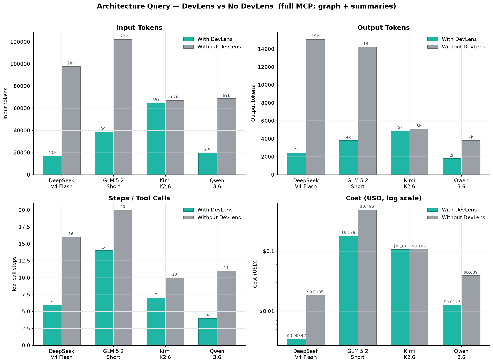

<div align="center">


# DevLens

**Intelligent codebase visualizer.**

Turn any TypeScript, JavaScript, Python, Go, Rust, or Java repository into a living, queryable graph. Every node carries a functional summary, a technical summary, and a security assessment.

[](https://www.gnu.org/licenses/agpl-3.0)
[](https://www.npmjs.com/package/@devlensio/cli)
[](https://bun.sh)

**[Join the DevLens Cloud Waitlist →](https://devlens.io)**

</div>

---

[](https://youtu.be/6OMsk8lNv4c?si=wpYF80IcfuJpN_Gf)

<p align="center"><em>Click the image to watch the demo</em></p>

---

## Table of Contents

- [What is DevLens?](#what-is-devlens)
- [Supported languages](#supported-languages)
- [Prerequisites](#prerequisites)
- [Quick Start](#quick-start)
- [Use it with your AI agent (MCP)](#use-it-with-your-ai-agent-mcp)
- [Search index](#search-index)
- [Web UI](#web-ui)
- [CLI](#cli)
- [How to summarize](#how-to-summarize)
- [Configuration](#configuration)
- [What DevLens understands](#what-devlens-understands)
- [Benchmarks](#benchmarks)
- [Who is this for](#who-is-this-for)
- [How DevLens compares](#how-devlens-compares)
- [Repository layout](#repository-layout)
- [DevLens Cloud](#devlens-cloud)
---

## What is DevLens?

**DevLens turns a codebase into a pre-built dependency graph.** Instead of reading files one at a time, you (or your AI agent) query the graph: every component, class, function, route, struct, or trait is a **node**, and every connection is a **typed edge** (`CALLS`, `IMPORTS`, `HANDLES`, `IMPLEMENTS`, ...). Each node carries a **functional** summary (what business purpose it serves), a **technical** summary (how it works), and a **security** assessment (severity plus explanation).

**Typical use cases:** onboarding (architecture, modules, and gotchas in minutes), impact analysis (see a symbol's blast radius before changing it), security reviews (severity-ranked findings with real reach), PR review (impact, tests, and security delta), and AI agents (query the graph through MCP instead of re-reading files).

---

## Supported languages

DevLens parses **five language families with native parsers** (no AI, no regex, no tree-sitter) and understands their frameworks. Summaries are never generated silently: you confirm before tokens are spent, and structure-only analysis needs no provider at all.

| Language | Frameworks / stacks the graph understands | What gets parsed |
| :-- | :-- | :-- |
| **TypeScript / JavaScript** | React, Next.js (app and pages router), Express/Hono/Fastify, React Router, TanStack Router, any Node | components, hooks, state stores, classes, methods, functions, routes |
| **Python** | FastAPI, Flask, Django (+DRF), SQLAlchemy / Django ORM, Celery, Pydantic | classes, methods, functions, routes, data models |
| **Java** | Spring Boot (controllers, JPA, Spring Data repositories) | classes, methods, interfaces, enums, routes |
| **Go** | net/http, Gin, Echo, chi, Fiber, GORM, database/sql | structs, interfaces, methods, functions, routes |
| **Rust** | axum, actix-web, rocket, utoipa, Diesel | structs, enums, traits, impl blocks, methods, functions, routes |

Each repo is analyzed with its language's own parser (Python `ast`, JavaParser, Go `go/ast` plus `go/types`, Rust `syn`, TS compiler API), so edges are real: type-checked interfaces (`IMPLEMENTS`), framework routes (`HANDLES`), and ORM data layers (`READS_FROM`, `WRITES_TO`).

---

## Prerequisites

| Requirement | Needed for | Notes |
| :-- | :-- | :-- |
| [Bun](https://bun.sh) 1.x or later | Build and run from source | macOS, Linux, Windows |
| [Node.js](https://nodejs.org) 18 or later | `npm install -g @devlensio/cli` | not needed for the standalone binary |
| `git` | analyzing a repo | required on all install paths |
| JVM 17+ | Java analysis | only when analyzing Java repos |
| `python3` 3.11+ | Python analysis | only when analyzing Python repos |
| An LLM provider API key | AI summaries (optional) | only needed for `--summarize`; structure-only analysis works offline |

---

## Quick Start

### Option A: Clone and run from source (Web UI + CLI together)

```bash
git clone https://github.com/devlensio/devlensOSS.git
cd devlensOSS
bun install
bun dev     # backend :3000 + hot-reloaded frontend :3001
bun start   # OR production: API + Web UI on a single port (:3000)
```

`bun start` builds the frontend only the first time. Open the printed URL, paste an absolute repo path, and click **Analyze**.

### Option B: Install the CLI from npm

```bash
npm install -g @devlensio/cli
```

### Option C: Install the standalone binary (no Node.js required)

The installers print progress, warnings, and next steps, and automatically add `devlens` to your `PATH`.

```bash
# Linux / macOS
curl -fsSL https://raw.githubusercontent.com/devlensio/devlensOSS/main/scripts/install.sh | sh

# Windows (PowerShell)
irm https://raw.githubusercontent.com/devlensio/devlensOSS/main/scripts/install.ps1 | iex
```

Environment variables: `DEVLENS_VERSION`, `DEVLENS_INSTALL_DIR`, or `DEVLENS_NO_PATH=1` to skip the automatic PATH setup.

Then `cd your-project`, run `devlens analyze . --summarize` to build the graph, and either explore from the [CLI](#cli), the [Web UI](#web-ui), or your [AI agent](#use-it-with-your-ai-agent-mcp).

---

## Use it with your AI agent (MCP)

The MCP server is the primary way to use DevLens. Your agent asks a question in plain words and gets a compact, task-shaped answer with the files and symbols that matter, instead of reading your repo file by file.

### Setup in three steps

```bash
# 1. Install the CLI
npm install -g @devlensio/cli

# 2. Analyze the repo you want your agent to understand
devlens analyze /path/to/repo --summarize

# 3. Register DevLens in your MCP client
claude mcp add devlens -- devlens mcp
```

Step 3 also works for Claude Desktop, Cursor, and any other MCP client. For an HTTP transport instead of stdio:

```bash
devlens mcp http -p 7000
```

### What your agent can ask

| Tool | What it does |
| :-- | :-- |
| `resolve_context` | **The front door.** One call returns a task-shaped packet: ranked nodes with one-line meanings, call flow, involved files, key code bodies, security flags, and an id map, within a token budget. Intents: `pinpoint`, `reference-list`, `flow`, `overview`, `concept`, `security-audit`, `exploratory`. |
| `blast_radius` | Cheap change-impact wrapper: what depends on a symbol, packed small. |
| `find_symbols` | Cheap BM25F name lookup: nodeIds plus `file:line`, no graph, no source. |
| `get_node` | Full detail for one node: technical, business, and security summaries plus metadata. |
| `get_node_code` | Raw source for one node (expensive, so use it last). |
| `get_blast_radius` / `get_khop` | Upstream dependents or downstream dependencies out to a chosen radius. |
| `get_summaries` | Batch-read summaries for several node ids. |
| `get_security_issues` | Security findings with severity and explanation. |
| `check_freshness` | Is the graph stale versus the working tree? |

Symbol search is **lexical BM25F** (field-weighted across name, path, and both summary kinds, with English stemming), not embeddings: it runs entirely on your machine, offline, with no API key. The server self-describes its full tool list through `tools/list`, so your agent can discover the rest.

### Freshness you can trust

Every response carries a `provenance` block (`commitHash`, `analyzedAt`, `hasGit`), so your agent always knows which snapshot answered the question. If a response sets `needsReanalyze: true`, the graph is too old (or predates the search index) and the user should run `devlens analyze`. For repos without git, DevLens keys the snapshot by content, so re-analyzing unchanged code updates the same snapshot instead of piling up new ones.

> **Full reference:** [`src/mcp/README.md`](src/mcp/README.md) for the tool catalog, registration, and configuration.

---

## Search index

Each analyzed commit gets a derived BM25F search index next to the graph, at `~/.devlens/graphs/<graphId>/commits/<commitHash>.search.json`.

- Every `devlens analyze` and `devlens summarize` rebuilds the index for the commit it produced, so search is ready immediately.
- Graphs built by older DevLens versions have no index. They are indexed **lazily on the first search**, or you can index everything up front with `devlens reindex`.
- The index is derived data: deleting it is safe, it rebuilds on demand.

```bash
devlens reindex                                  # latest commit of every graph
devlens reindex <graphId>                        # every commit of one graph
devlens reindex <graphId> <commitHash> --force   # one commit, rebuilt even if present
```

The same operations are available over HTTP: `POST /api/reindex` and `POST /api/reindex/:graphId?commitHash=...&force=1`.

---

## Web UI

*For when you want to see your codebase laid out as an interactive graph.*

Open the Web UI, paste your repo path, and explore a force-directed canvas. Click any node to see its summaries, callers, callees, and security flags. Search, filter, and diff commits across versions. The Project panel shows search index readiness with a one-click **reindex** action.

```bash
bun start   # from the source repo: API + Web UI on one port (http://localhost:3000)
```

The Web UI runs from the source tree, it is not bundled into the installed CLI binary.

---

## CLI

*For scripts, CI, and fast answers without leaving the terminal. Every command supports `--json` for piping into scripts, `-v/--verbose` for diagnostics, and `--quiet` for minimal output.*

**Analyze and summarize**

| Command | What it does |
|---------|--------------|
| `devlens detect [path] [--deps]` | Inspect a repo before analyzing: language, manifest, dependency count, source files |
| `devlens analyze [path] [--summarize] [--force-summarize]` | Build the graph and its search index (optionally add AI summaries) |
| `devlens summarize [target]` | (Re)generate technical, business, and security summaries |
| `devlens status` | Which repos are analyzed, their language and summary coverage |
| `devlens doctor` | Environment health check: git, storage, LLM provider, and the four extractor runtimes (go, rust, java, python) |
| `devlens init` | First-time setup: configure the LLM provider interactively |

**Explore and understand**

| Command | What it does |
|---------|--------------|
| `devlens overview` | Big picture: language, framework, stats, central nodes |
| `devlens top-nodes [-l <n>]` | Highest-scoring (most central) nodes |
| `devlens find-nodes <name> [-t <type>]` | Search by name, type, file, or severity (for example `-t ROUTE`) |
| `devlens nodes-in-path <path>` | All nodes in a file or folder |
| `devlens get-node <id>` | Full detail for one node: summaries, callers, callees |
| `devlens node-code <id>` | Raw source for a node (expensive, prefer `get-node`) |
| `devlens architecture` | One-call architecture brief: modules, routes, flows, health |
| `devlens get-context <query>` | Token-budgeted context packet for an agent |

**Impact and quality**

| Command | What it does |
|---------|--------------|
| `devlens blast-radius <id>` | What breaks if I change this (upstream dependents) |
| `devlens khop <id>` | What does it depend on (downstream) |
| `devlens subgraph <seed>` | The cohesive cluster (module) a node belongs to |
| `devlens cycles` | Circular dependencies |
| `devlens security [--min-severity ...]` | Security findings with severity and explanation |
| `devlens security-brief` | Ranked security report with blast-radius reach |
| `devlens diff <from> <to>` | Compare two analyzed commits |
| `devlens review-pr <from> <to>` | PR review packet: diff, impact, tests, security delta |
| `devlens check-freshness` | Is the graph stale versus HEAD? |

**Manage and integrate**

| Command | What it does |
|---------|--------------|
| `devlens config` | View or set LLM provider config (`~/.devlens/config.json`) |
| `devlens repos` | List analyzed repos |
| `devlens graphs list \| delete` | Manage stored graphs |
| `devlens reindex [graphId] [commitHash] [--force]` | Rebuild the local search index (`.search.json`) without re-analyzing. No arguments reindexes the latest commit of every graph |
| `devlens serve` | Start the backend HTTP API only (used by the MCP server and the Web UI) |
| `devlens mcp` | Run the MCP server (see [MCP](#use-it-with-your-ai-agent-mcp)) |

**Hands-on examples**

```bash
devlens analyze . --summarize             # graph + summaries + search index
devlens find-nodes -t ROUTE               # every route in the app
devlens blast-radius "src/auth/login.ts::login"
devlens reindex                          # index everything up front
```

> **Full reference:** [`src/cli/README.md`](src/cli/README.md) for every command with options and examples. Agent skills are deprecated; DevLens now works through its MCP tools, which describe themselves.

---

## How to summarize

Summaries are per-node AI descriptions that make querying much richer. Run them during analysis, or any time later:

```bash
devlens analyze . --summarize                  # during analysis (recommended)
devlens summarize .                            # current directory's repo
devlens summarize <graphId>                    # a stored graph
devlens summarize . --force-summarize          # re-generate even if summarized
devlens summarize . --provider openai --provider-name deepseek --model deepseek-v4-flash
```

When a repo is re-summarized, only nodes without summaries are processed, so tokens are not spent twice. Configure your provider once with `devlens init`.

---

## Configuration

Config lives in `~/.devlens/config.json`, set via `devlens init` or `devlens config`. Models are discovered dynamically from each provider's `/models` endpoint, so there are no hardcoded model lists.

| Provider | Recommended model | Notes |
| :-- | :-- | :-- |
| Ollama (local) | `qwen2.5-coder:7b` | Free, local, 8 GB+ RAM |
| OpenAI | `gpt-4o-mini` | Fast, cost-effective |
| Anthropic | `claude-haiku-4-5` | Best cost/quality for summaries |
| DeepSeek | `deepseek-v4-flash` | Strong code model |
| OpenRouter | `deepseek-v4-flash` or `mimo-v2.5` | Best cost/quality balance |
| Gemini | `gemini-2.0-flash` | Fast, large context |

```bash
devlens config --set                            # interactive setup
devlens config --provider openai --provider-name deepseek --model deepseek-v4-flash --api-key <key>
devlens config --active openai:deepseek          # switch saved provider
devlens doctor                                  # health check
```

---

## What DevLens understands

A graph is per repo and per language. Node types include `FILE`, `FUNCTION`, `METHOD`, `CLASS`, `INTERFACE`, `STRUCT`, `ENUM`, `TRAIT`, `IMPL_BLOCK`, `ROUTE`, `COMPONENT`, `HOOK`, `STATE_STORE`, `UTILITY`, `TEST`, `STORY`, and `THIRD_PARTY` (language dependent). Every node carries an importance score plus its functional, technical, and security summaries once summarized.

Edge types (the connections the graph draws): `CALLS`, `IMPORTS`, `READS_FROM`, `WRITES_TO`, `PROP_PASS`, `EMITS`, `LISTENS`, `WRAPPED_BY`, `GUARDS`, `HANDLES`, `TESTS`, `USES`, `NEXTJS_API_CALL`, `NAVIGATES_TO`, `IMPLEMENTS` (class to interface, trait, or ABC), `EXTENDS` (class to base class). `EXPORTS`, `THROWS`, `MODULE`, and `PACKAGE` are reserved for future languages.

Router awareness: routes are real graph nodes, for Next.js (app and pages), React Router, TanStack Router, wouter, Express, Fastify, Hono, Koa, Django URLconf and DRF, Flask blueprints, `@RestController` (Spring), Gin, Echo, chi, plain HTTP handlers, axum, actix, and rocket.

---

## Screenshots

<div align="center">


<br/>
<em>Graph explorer · node inspector with summaries and security risk · focused subgraph · security findings</em>
</div>

---

## Why it's fast and cheaper

A node summary is roughly 50 tokens. The file it describes is roughly 2,000. Querying summaries and graph slices costs a fraction of reading files, so humans get answers faster and AI agents spend dramatically fewer tokens on the same task.

---

## Benchmarks

*Real-world tasks (architecture understanding, feature implementation, bug finding) comparing the same models (DeepSeek V4 Flash, GLM 5.2, Kimi K2.6, Qwen 3.6) with and without DevLens.*

### Architecture understanding (full DevLens MCP)

<div align="center">

</div>

| Metric | Without DevLens | With DevLens | Improvement |
|--------|:--------------:|:------------:|:-----------:|
| Avg cost per query | $0.163 | **$0.075** | **54% cheaper** |
| Avg input tokens | 88,980 | **35,035** | **61% less** |
| Avg output tokens | 9,549 | **3,233** | **66% less** |
| Avg tool steps | 14.3 | **7.8** | **45% faster** |
| Structured output | 50% | **100%** | **2x more reliable** |
| Architectural debt found | 0% | **50%** | **Now discoverable** |

> Even the strongest tested model was **81% cheaper** ($0.0035 vs $0.0185) and used **83% fewer input tokens** with DevLens.

---

## Who is this for

- **Developers and teams**: onboard in hours not weeks, review PRs with impact context, catch circular dependencies and god-files, keep living documentation.
- **Engineering leaders**: a bird's-eye architecture view, spot debt before it becomes a crisis.
- **AI-augmented developers**: stop letting your agent burn tokens re-reading files; it queries the graph instead.

---

## How DevLens compares

DevLens is the only tool in this space that combines three things: native semantic parsing (not regex or tree-sitter), per-node AI summaries with per-node security analysis, and framework-aware data edges (routes, ORM reads and writes). It is also the only option you can use commercially under AGPL.

| Dimension | **DevLens** | **Graphify** | **GitNexus** | **Sourcegraph** | **DeepWiki** |
| :-- | :-- | :-- | :-- | :-- | :-- |
| Parsing depth | **Native semantic parsers** (TS compiler, Python `ast`, `go/types`, JavaParser, `syn`), type-resolved | tree-sitter (syntactic, no type info) | tree-sitter + native bindings (no type info) | SCIP/LSIF symbol index + language servers (no semantic parse) | LLM reads source directly (no structured parser) |
| Edge quality | **Type-checked `IMPLEMENTS`/`EXTENDS`**, framework **routes** (Next.js, Django, Spring, Gin, axum), **ORM data edges** (`READS_FROM`/`WRITES_TO`) | `EXTRACTED`/`INFERRED`/`AMBIGUOUS` tags, no type or framework awareness | call chains, clusters, processes, `route_map`, no ORM or data edges | precise symbol cross-references (SCIP), no type-checked inheritance | docs-level relationships (no structured graph) |
| Per-node AI summaries | **Technical + business + security** with severity on every node | No (LLM used for docs and concepts) | No (embeddings for semantic query) | Via Cody (hover and inline docs, chat-level) | Auto-generated docs per symbol (no security, no technical/business split) |
| Security analysis | **Per-node severity + blast-radius reach** with real exploit descriptions | No | Partial (opt-in PDG/taint) | No (compliance certifications only) | No |
| Agent / MCP integration | CLI + **self-describing MCP server** + Web UI | CLI + local skill (no MCP) | CLI + 17-tool MCP + hooks (`AGENTS.md`) | MCP server (cross-repo search, not per-repo graph queries) | Unknown (no public MCP integration) |
| Language coverage | TS/JS, Python, Java, Go, Rust with **native parsers for each** | 12 code families + docs/images (shallow syntactic) | Many via tree-sitter (Dart/Kotlin/Swift), shallow syntactic | 30+ via language servers (symbol-level, no semantic edges) | Any (LLM reads source, no structured extraction) |
| License / pricing | **AGPL-3.0, free, including commercial use** | Apache-2.0 | PolyForm Noncommercial (cannot use commercially) | Open-source core, Enterprise paid | Free for public repos, enterprise tiers unlisted |

**Other notable alternatives:** CodeSee (enterprise-only dependency mapping), CodeQL (GitHub-native security, no AI summaries or graph), and ctags-based indexers (symbol indexes, no graph intelligence).

**Why teams choose DevLens:** semantic edges that syntactic tools cannot produce (type-checked inheritance, ORM data flow, framework routes), per-node security analysis that no other open-source tool provides, and a single MCP front door (`resolve_context`) plus a Web UI.

(Feature comparison from public sources, Aug 2026.)

---

## Repository layout

```
devlensOSS/
├── src/
│   ├── cli/                  # `devlens` CLI (commander program + commands)
│   ├── core/                 # Shared query core (CLI + MCP, they never drift)
│   ├── mcp/                  # MCP server (stdio + HTTP) and packet renderer
│   ├── search/               # Local BM25F search stack (index, query, cache)
│   └── server/               # HTTP API for the Web UI + Next.js proxy
├── frontend/                 # Next.js graph visualizer (Cytoscape)
├── plugins/devlens/          # Deprecated agent skill source (old installs)
├── packages/skill-installer/ # @devlensio/skill (deprecated)
├── bin/ + npm/<platform>/    # Launcher and prebuilt binary packages
├── scripts/                  # Release tooling + start.mjs (bun start build-or-skip)
└── server.json               # MCP registry manifest
```

The analysis engine (native parsers and graph build) ships as the separate [`devlensio`](https://www.npmjs.com/package/devlensio) package.

---

## DevLens Cloud

A hosted version is in development: shareable graphs, team workspaces, live per-commit documentation with node summaries, detailed PR analysis (summary, impact, security), commit diffs showing added/modified/deleted nodes, an AI-native chat over your codebase, and no local setup.

**[Join the waitlist →](https://devlens.io)**

---

## License

AGPL-3.0. Part of the [`devlensio`](https://github.com/devlensio) family of tools.
