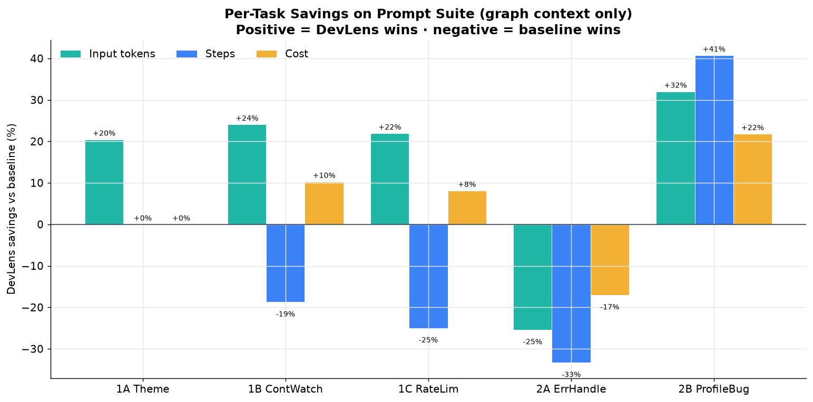

# `@devlensio/skill` — DevLens Agent Skill

[](https://www.npmjs.com/package/@devlensio/skill)
[](https://www.gnu.org/licenses/agpl-3.0)

Teach your AI coding agent to understand your full JavaScript, TypeScript, React, Next.js, or Node.js codebase in one command.

---

## What it does for you

**Without DevLens**, your AI agent reads files one at a time — it has no idea how components connect, what depends on what, or where security issues lurk. It burns tokens re-discovering the same connections every session.

**With the DevLens Skill**, your agent has a pre-built graph of every node in your codebase — with functional summaries, technical summaries, and security analysis. Type `/devlens` and get instant answers.

| Before (agent alone) | After (with DevLens Skill) |
|----------------------|---------------------------|
| Reads files one by one, 2,000+ tokens each | Queries the graph: ~50 tokens per node |
| No idea how components connect | Sees every edge — IMPORTS, CALLS, PROP_PASS, navigations |
| Misses architectural debt | Surfaces circular deps, god-files, coupling hotspots |
| No per-component security insight | Every node has a security assessment |
| Can't see big picture without reading everything | `/devlens architecture` — full overview instantly |

---

## Real benchmarks — with DevLens vs without

*Tested across 4 different LLMs (DeepSeek V4 Flash, GLM 5.2, Kimi K2.6, Qwen 3.6) on real-world tasks — architecture understanding, feature implementation, and bug finding — comparing the same model with and without DevLens.*

### Architecture understanding (full DevLens MCP)

<div align="center">

</div>

| Metric | Without DevLens | With DevLens | Improvement |
|--------|:--------------:|:------------:|:-----------:|
| Avg cost per query | $0.163 | **$0.075** | **54% cheaper** |
| Avg input tokens | 88,980 | **35,035** | **61% less** |
| Avg output tokens | 9,549 | **3,233** | **66% less** |
| Avg tool steps | 14.3 | **7.8** | **45% faster** |
| Structured architecture output | 50% | **100%** | **2× more reliable** |
| Architectural debt discovered | 0% | **50%** | **Now discoverable** |
| Avg cache hit rate | 75.2% | **83.7%** | **+8.5pp** |

<div align="center">


</div>

> Even the strongest model tested (DeepSeek V4 Flash) was **81% cheaper** ($0.0035 vs $0.0185) and used **83% fewer input tokens** with DevLens.

### Feature implementation & bug finding (DeepSeek V4 Flash)

*5 prompts across implementation and debugging tasks — DevLens graph context only (no per-node summaries).*

<div align="center">


</div>

| Task | Input tokens saved | Cache improvement |
|------|:-----------------:|:-----------------:|
| **Continue Watching** feature | **24%** less input (56.8k vs 74.9k) | +5.2pp cache |
| **Rate Limiting** feature | **22%** less input (32.1k vs 41.1k) | +8.3pp cache |
| **Error Handling** audit | *(comparable due to simple task)* | Comparable |
| **Profile Bug** trace | **32%** less input (36.9k vs 54.3k) | Similar |

### Quality impact

<div align="center">


</div>

When asked to explain a codebase's architecture:

| Capability | Without DevLens | With DevLens |
|-----------|:--------------:|:------------:|
| Produced structured output (diagrams, tables) | 50% | **100%** |
| Referenced specific graph metrics | 0% | **100%** |
| Identified architectural debt | 0% | **50%** |
| Named specific important files/modules | 75% | **100%** |

*(Benchmarked across DeepSeek V4 Flash, GLM 5.2, Kimi K2.6, and Qwen 3.6 — with and without DevLens.)*

---

## Install

```bash
npx @devlensio/skill install
```

This auto-detects which AI tools you're using and installs into each.

### Options

| Flag | What it does |
|:--|:--|
| `--harness=cursor` | Force install for a specific tool |
| `--global` | Install to home directory instead of project |
| `--force` | Re-copy after an update |

### Check your installation

```bash
npx @devlensio/skill check
```

### Prerequisite

The DevLens CLI must be installed globally:

```bash
npm install -g @devlensio/cli
```

---

## How to use

After installing, reload your AI tool and type `/devlens`:

### New to a codebase?

| Command | What it does |
|---------|-------------|
| `/devlens init` | First run — connect MCP, configure provider, analyze repo |
| `/devlens architecture` | Full system overview — stack, modules, all routes/stores, patterns |
| `/devlens explain [path]` | Understand a specific module — callers, callees, summaries |
| `/devlens onboard` | Generate a saved `ONBOARDING.md` for new devs |

### About to refactor?

| Command | What it does |
|---------|-------------|
| `/devlens impact <symbol>` | Blast radius — what breaks if you change this? |
| `/devlens tech-debt` | Circular deps, coupling hotspots, god-files |
| `/devlens guard [target]` | Warns if you're about to edit a critical/high-blast-radius node |

### Before shipping?

| Command | What it does |
|---------|-------------|
| `/devlens security-analysis [level]` | Prioritized security findings with exploit notes |
| `/devlens changes [range]` | Explain recent work — what changed and its impact |
| `/devlens diagram [type]` | Mermaid diagrams — architecture, clusters, flows, deps |

### Need to find something?

| Command | What it does |
|---------|-------------|
| `/devlens find <name>` | Locate any component, hook, or function |
| `/devlens summary <target>` | On-demand technical + business + security summaries |

---

## Supported tools

| Tool | Project install dir | Global install dir |
| :-- | :-- | :-- |
| **Claude Code** | `.claude/skills/devlens/` | `~/.claude/skills/devlens/` |
| **Cursor** | `.cursor/skills/devlens/` | `~/.cursor/skills/devlens/` |
| **Kilo Code** | `.kilo/skills/devlens/` | `~/.kilocode/skills/devlens/` |
| **opencode** | `.opencode/skills/devlens/` | `~/.config/opencode/skills/devlens/` |
| **pi** | `.agents/skills/devlens/` | `~/.pi/agent/skills/devlens/` |

Without `--harness`, the installer auto-detects which tools are in use from their marker directories (`.claude`, `.cursor`, `.kilo`, `.opencode`, `.agents`).

---

## Alternative: Claude Code plugin

```text
/plugin marketplace add devlensio/devlensOSS
/plugin install devlens@devlensio
```

Commands are namespaced as `/devlens:devlens <subcommand>`.

---

## How it works

1. **DevLens analyzes your codebase** — walks the AST, builds a graph of every node + typed edges, scores by importance, generates AI summaries
2. **The Skill teaches your agent** — when to query the graph, how to keep output token-cheap, how to produce thorough architecture/security/impact reports
3. **You type `/devlens <command>`** — agent queries the graph via MCP, returns structured results

---

## License

AGPL-3.0. Part of the [DevLens](https://github.com/devlensio/devlensOSS) project.